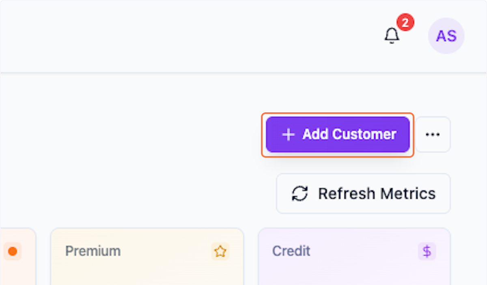
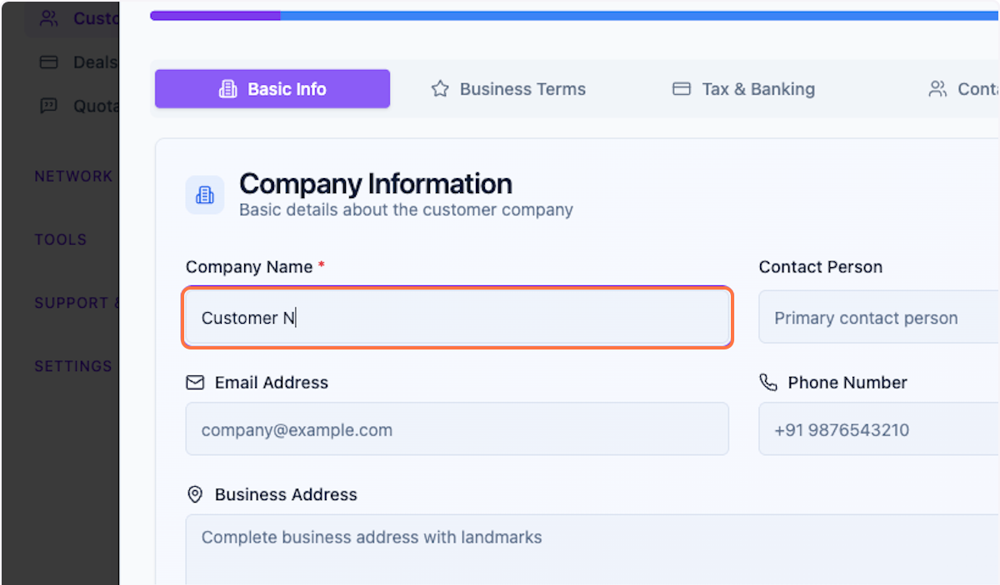
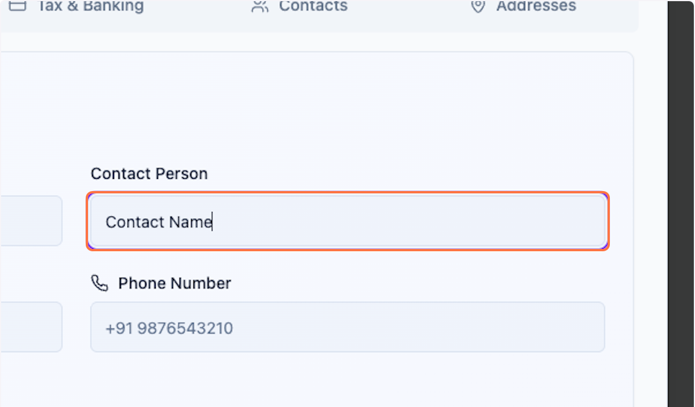
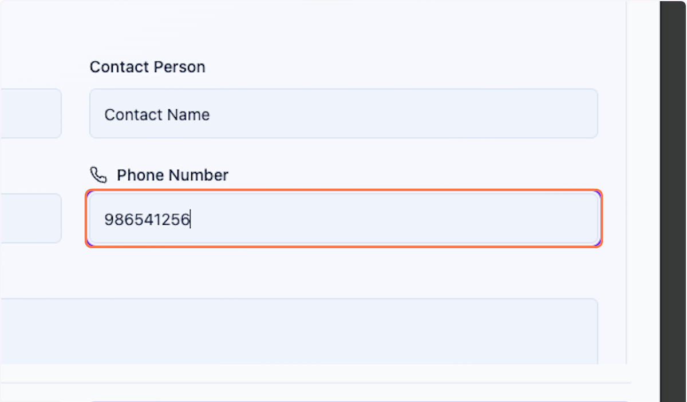
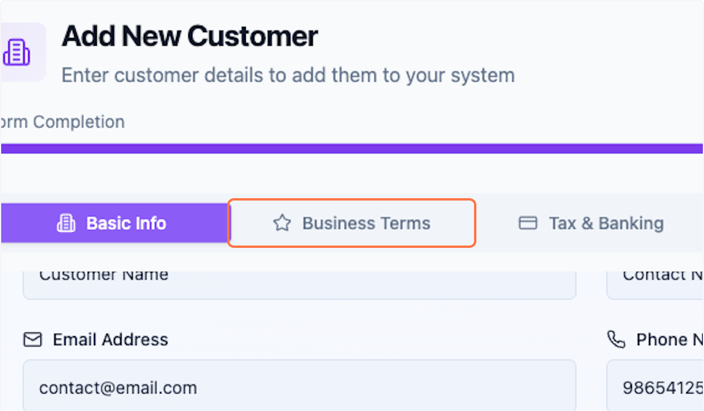
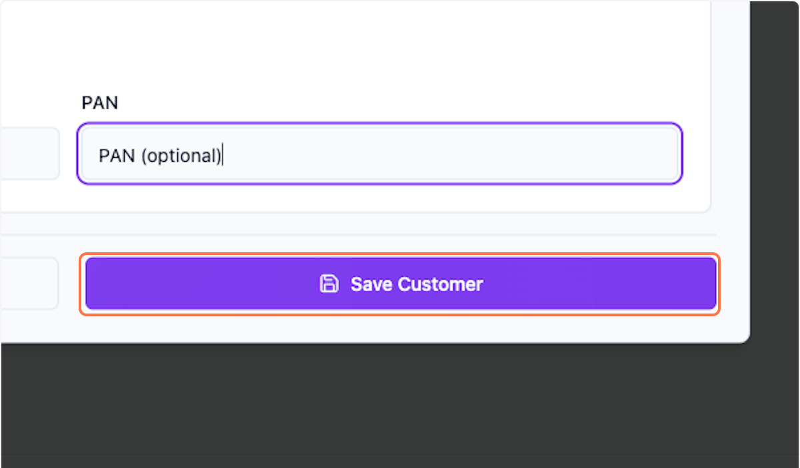

# 1.Customer

## # [Packwares CMS](https://cms.packwares.com/manufacturer/customers)

### 1. Click on Add Customer

### 2. Type "Customer Name"

### 3. Type "Contact Name" (optional)

### 4. Type "user@example.com" (optional)

### 5. Type "986541256" (optional)

### 6. Type "Details business address"

### 7. Click on Business Terms (optional)

you can do this later as well

### 8. Credit exposure at a given time

Enter value total credit exposure you can have with this customer

### 9. Click on Business Terms (optional)

You can fill this later as per your convinence.

### 10. Click on Tax & Banking (optional)

### 11. Click on Save Customer

 