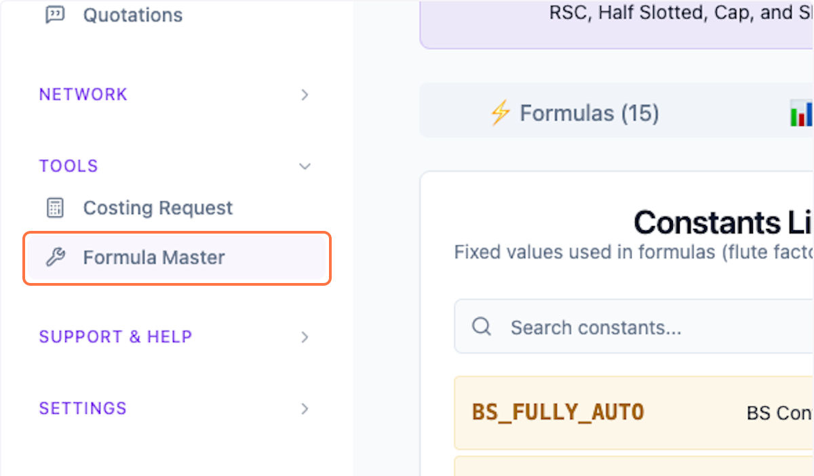
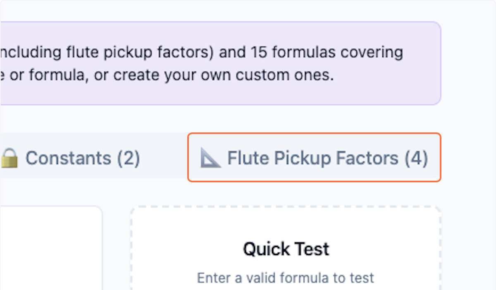
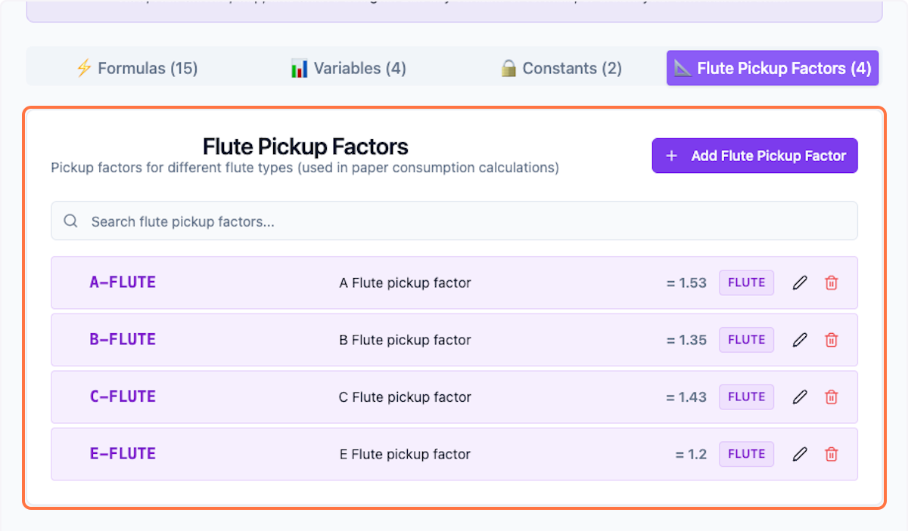
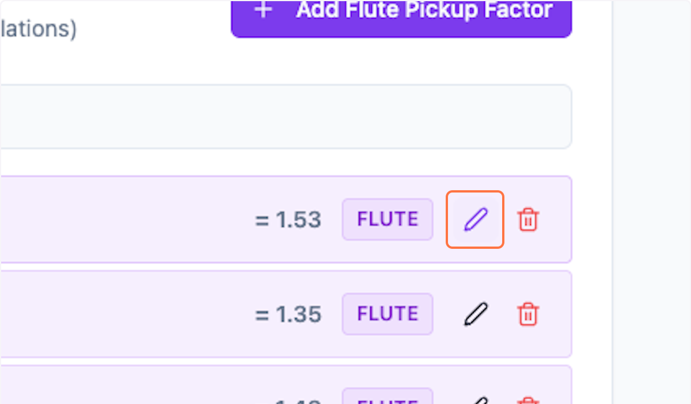
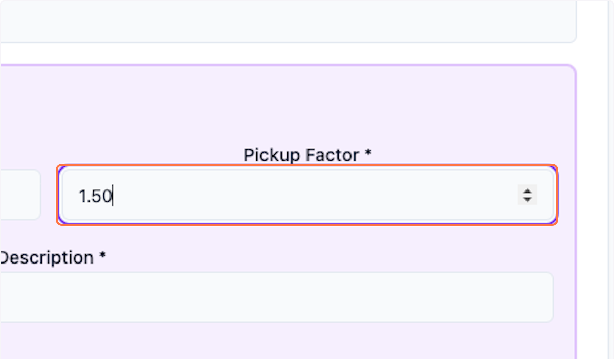
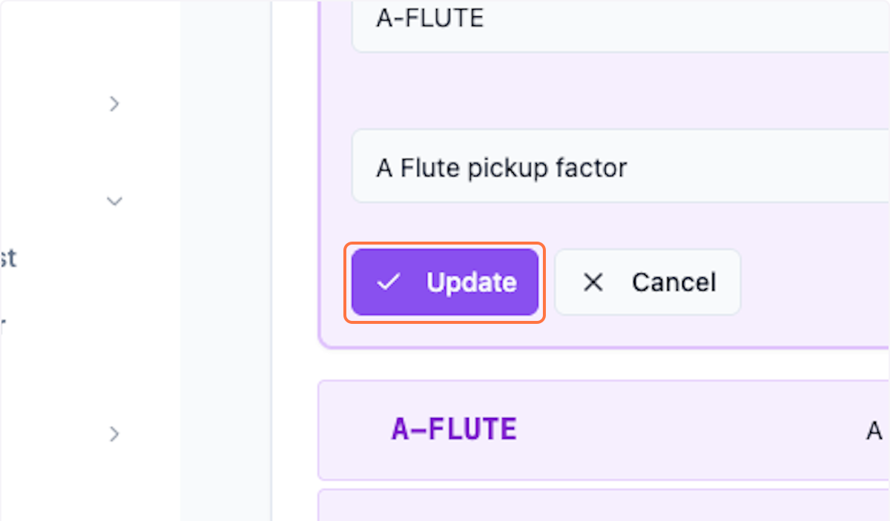
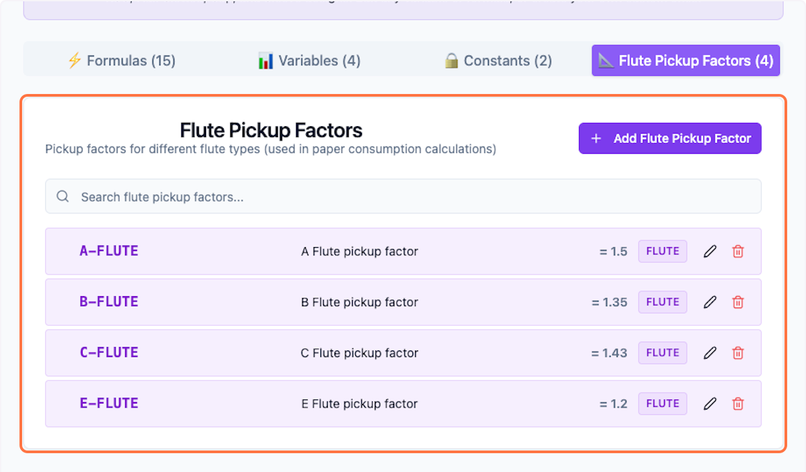

# Flute Pickup Factors in Packwares CMS

## # [Packwares CMS](https://cms.packwares.com/formula-master/constants)

### 1. Click on Formula Master

### 2. Click on 📐 Flute Pickup Factors

### 3. Preview all the available Pickup factors

### 4. Click on pencil icon to edit

### 5. Customize as needed.

### 6. Click on Update to save

### 7. Preview changes being made

 