# Ticket: Submit and Track Support Requests in Packwares CMS

## # [Packwares CMS](https://cms.packwares.com/manufacturer/customers)

### 1. Find the Help link in the footer on any page.
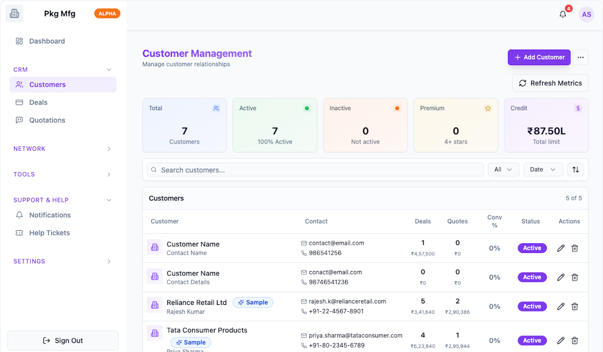

### 2. Click on Help
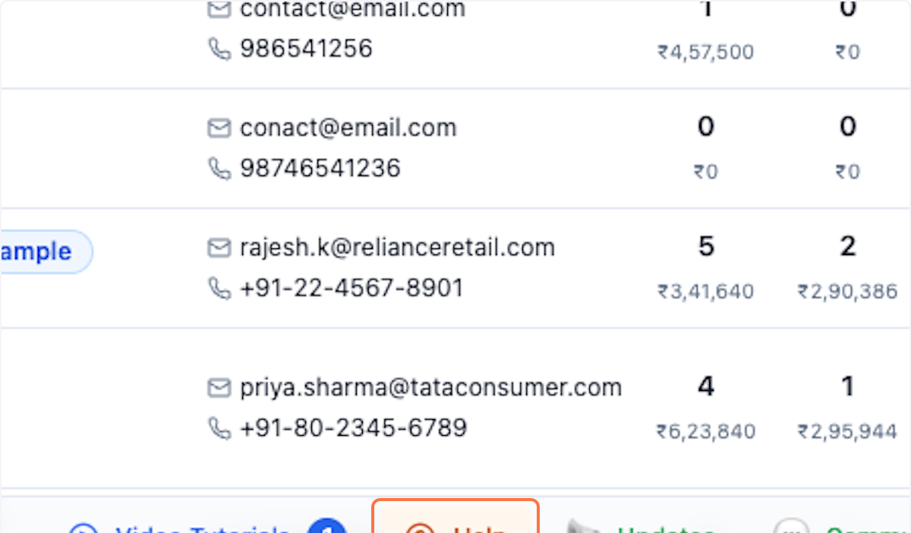

### 3. Click on Get Help & Support…
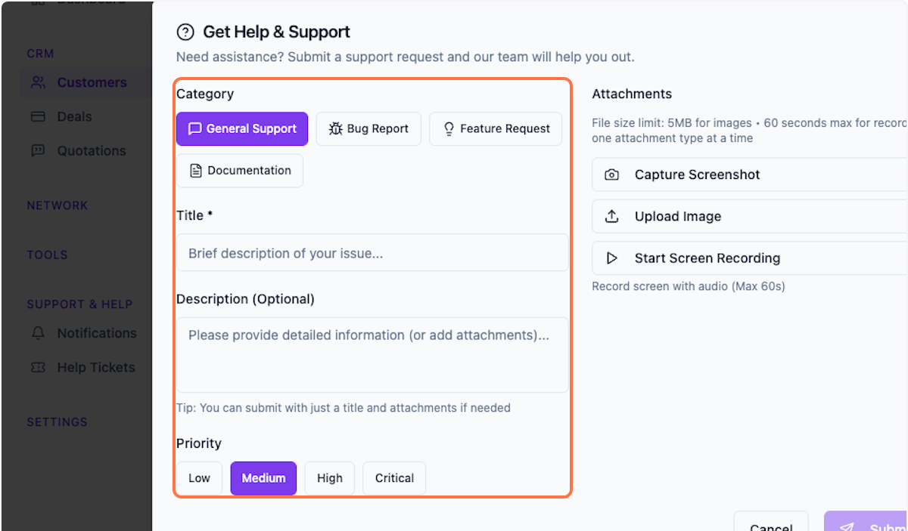

### 4. Select Categor
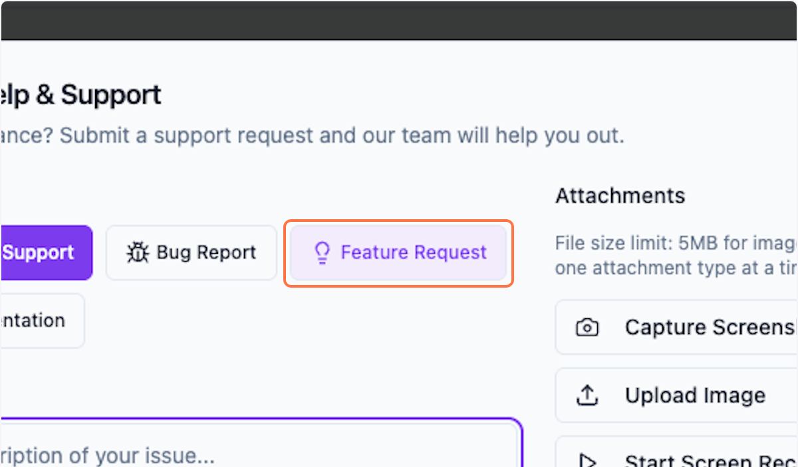

### 5. Fill in details
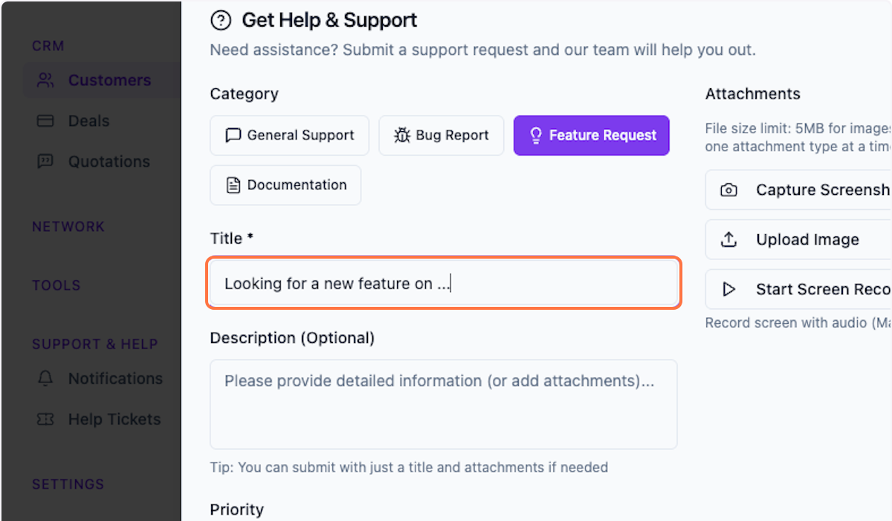

### 6. Share more details

Detailed explanations will help us understand your requirement better.

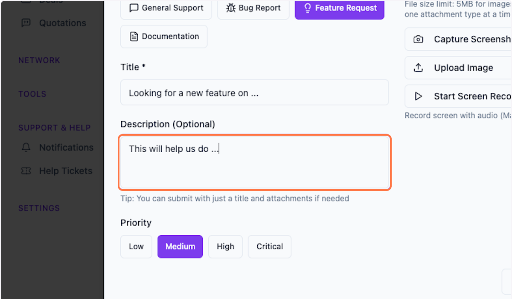

### 7. Select Priority 
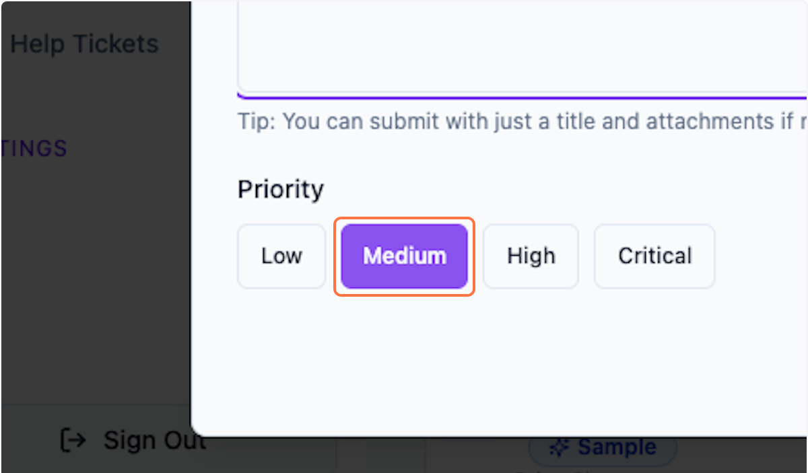

### 8. You can add attachments as well

1.  **Capture Screenshot** — Automatically captures the current view of your app so we can see exactly what you're seeing.
    
2.  **Upload Image** — Attach additional images as reference to help us understand your feedback better.
    
3.  **Start Screen Recording** — Record your screen with audio to show us exactly what's happening. This helps us understand the issue more clearly.
    

**Note:** Large files may cause submission errors. Maximum file size is 5MB.

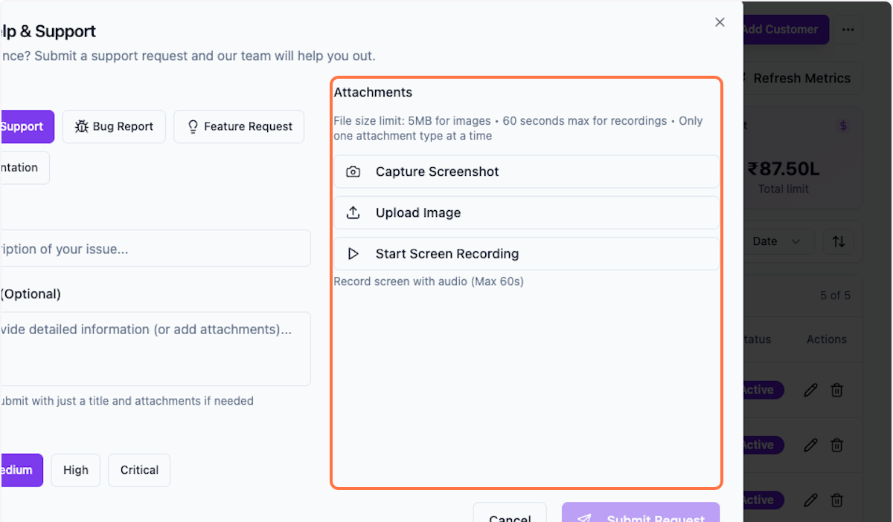

### 9. Start Screen Recording

Record your screen with audio to show us exactly what's happening. This helps us understand the issue more clearly.

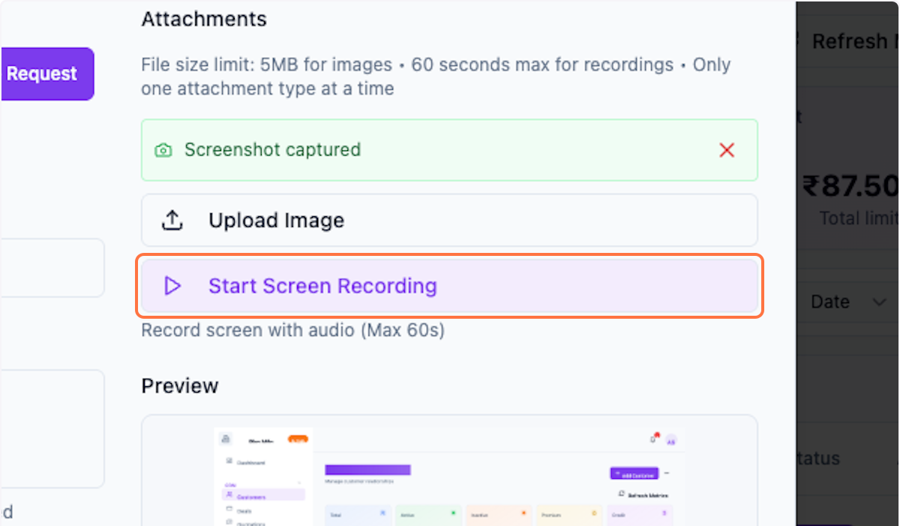

### 10. On the Popup, Click on Screen Recording…
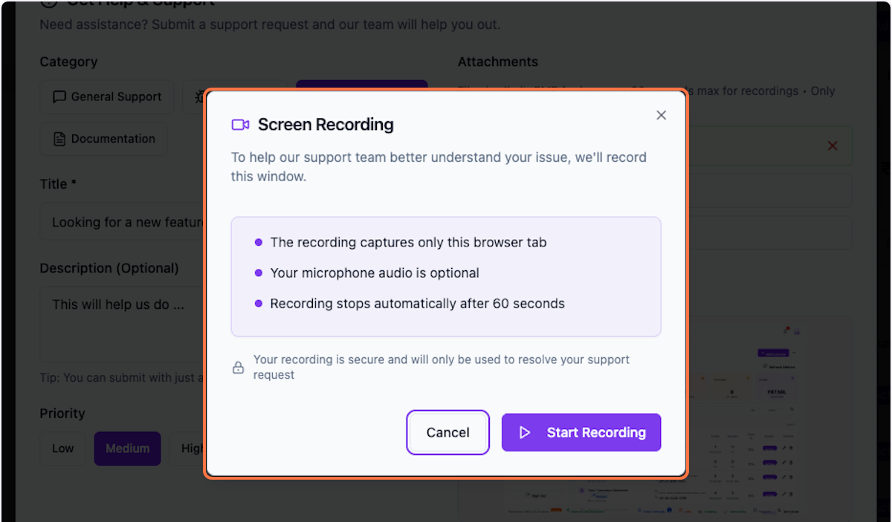

### 11. Once you are done, click on Stop Recording to end the recording
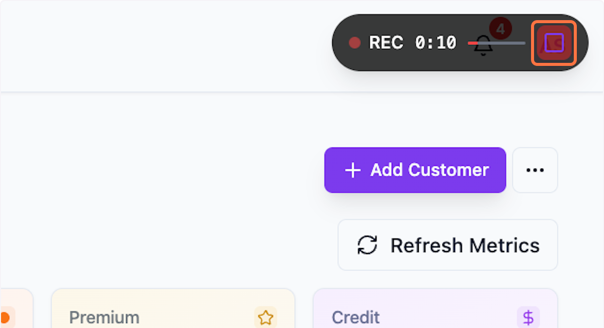

### 12. Preview your recording
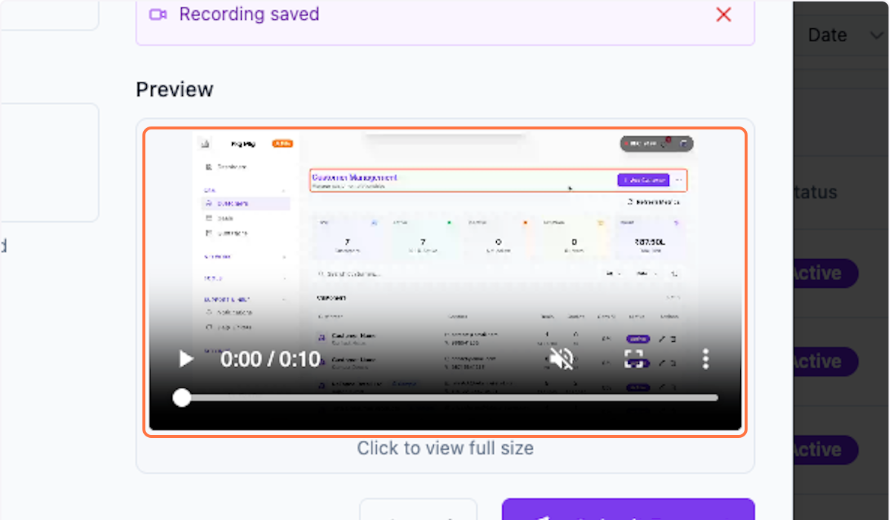

### 13. Click on Submit Request
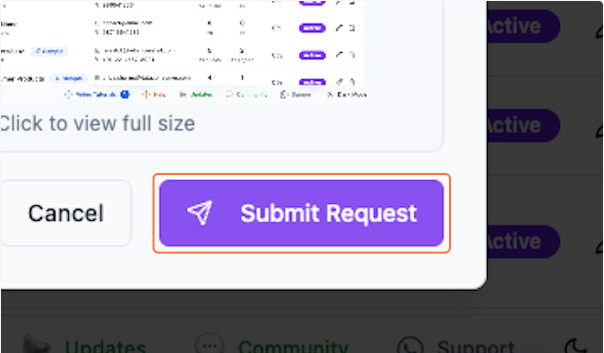

### 14. Click on Help & Support to find out your ticket. 
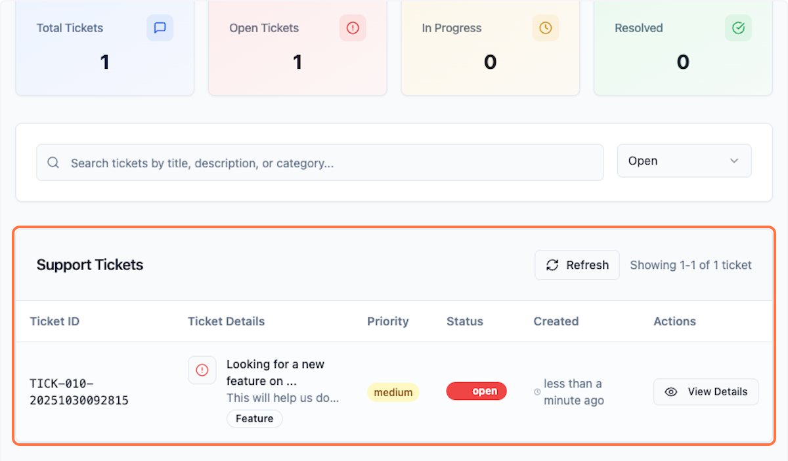

 