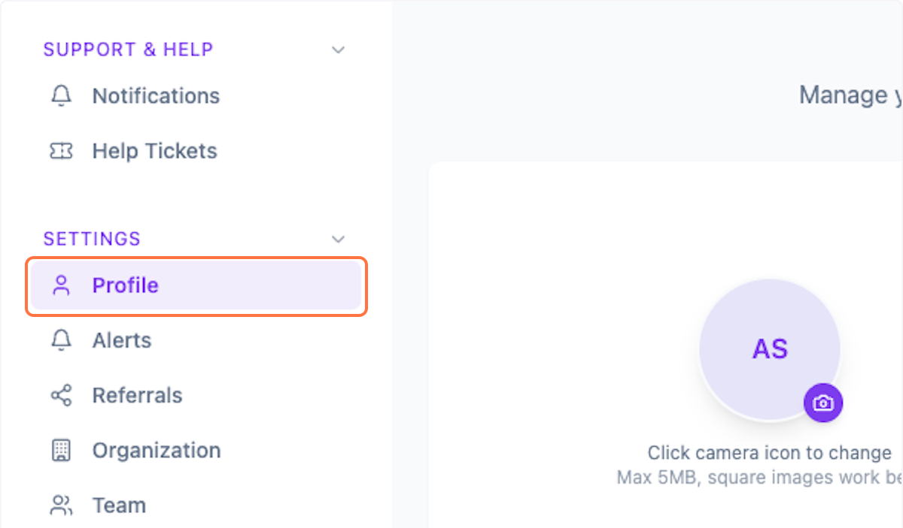
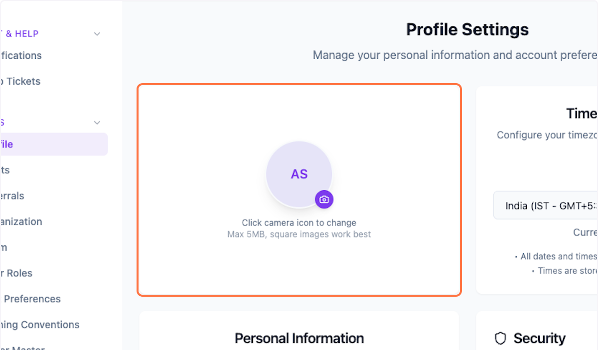
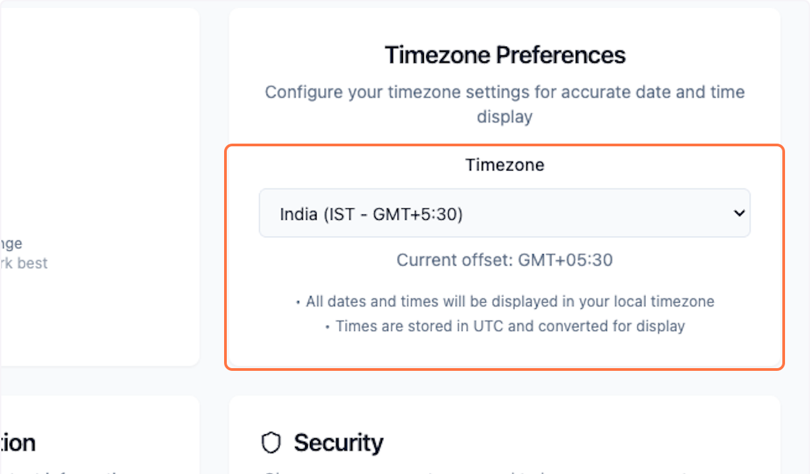
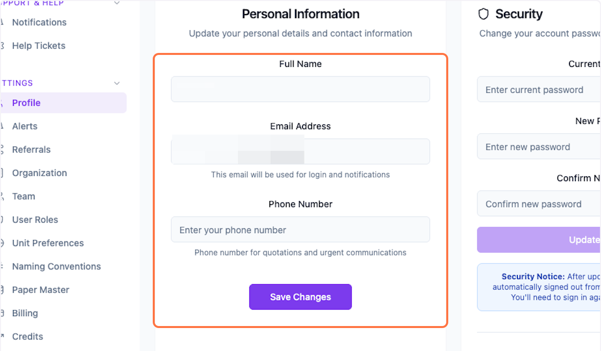

# Setting Profile Info in Packwares CMS

## # [Packwares CMS](https://cms.packwares.com/settings/profile)

### 1. Click on Setting > Profile

### 2. Upload profile image

### 3. Update Timezone…

### 4. Update personal info and save changes

 