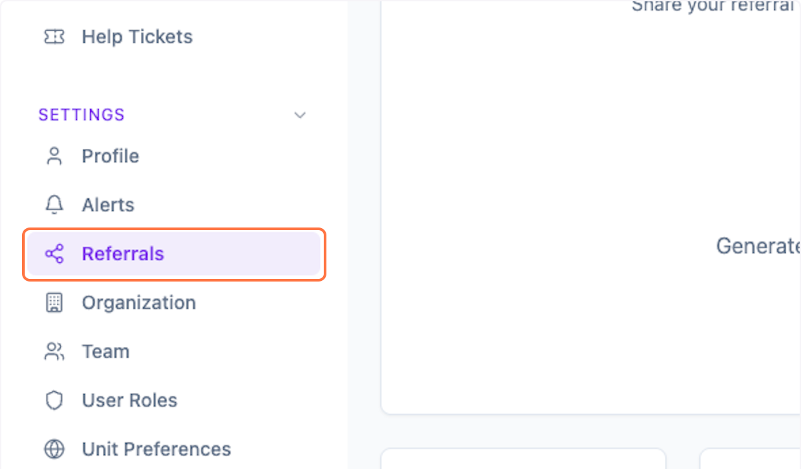
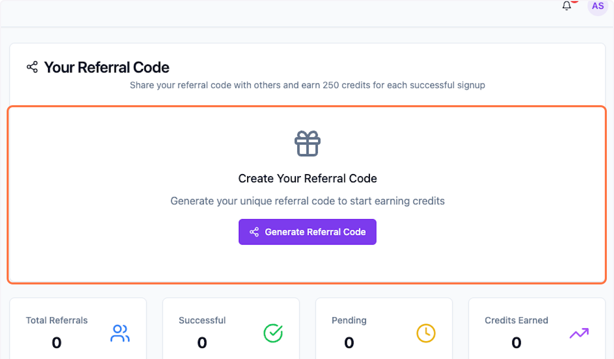
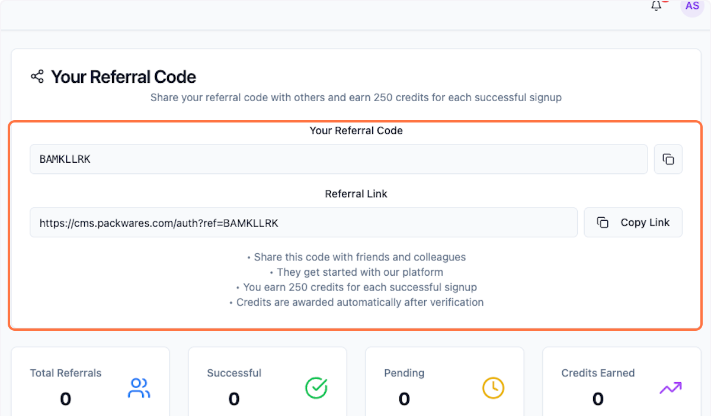
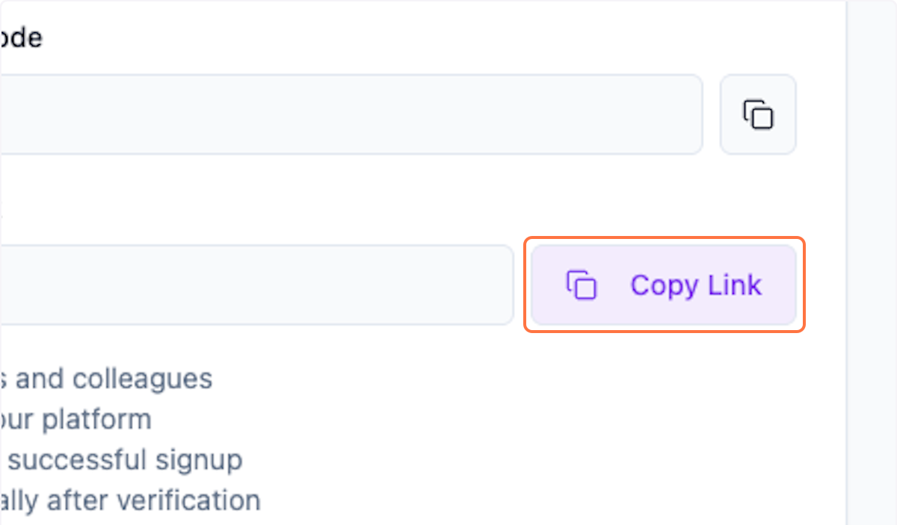
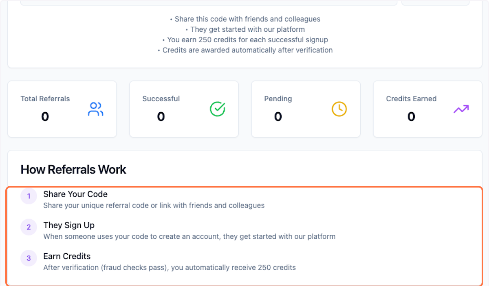

# Referral system in Packwares CMS

Earn credits through referrals and use the app for free.

## # [Packwares CMS](https://cms.packwares.com/settings/referrals)

### 1. Click on Setting > Referrals

### 2. Check if you already have a referral code 

### 3. Else click on Generate Referral Code

### 4. You can now see your referral code 

### 5. Click on Copy Link and share in your network

### 6. How Referrals work

 