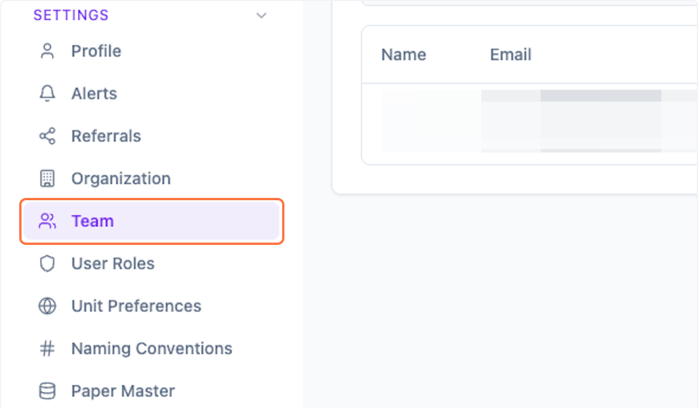
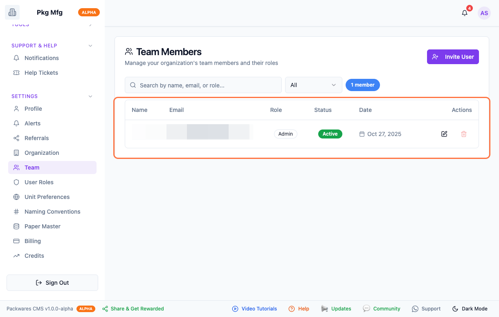
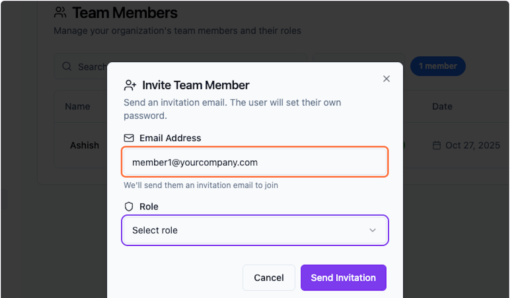
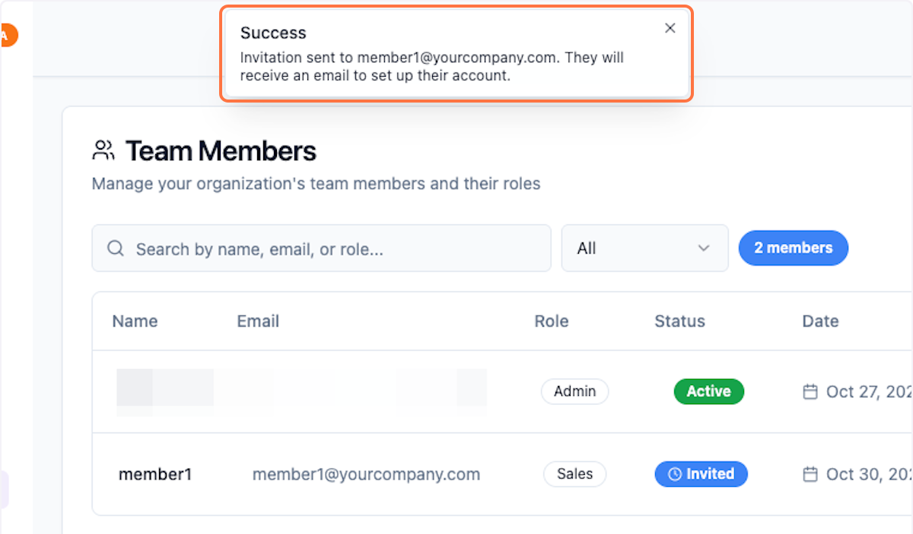
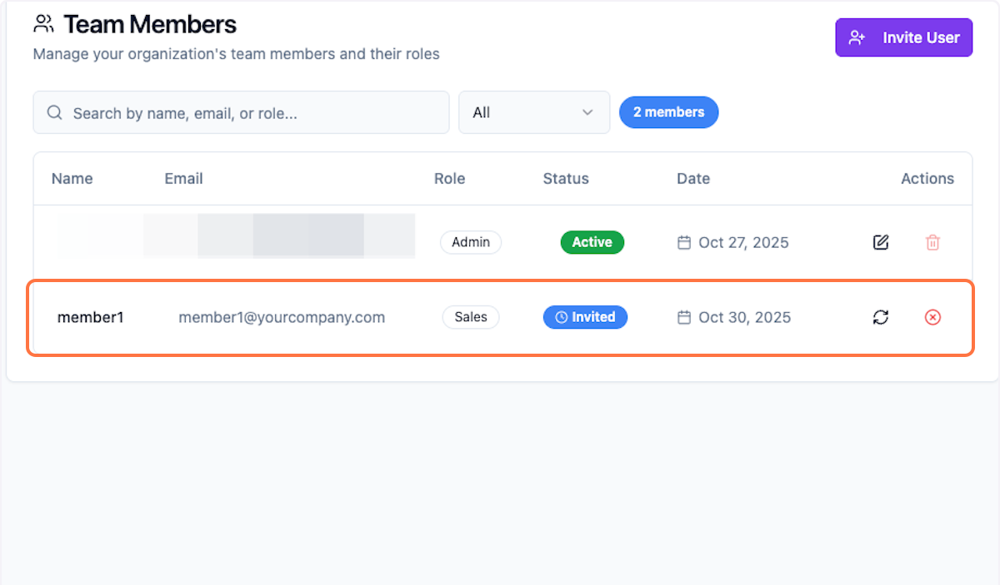
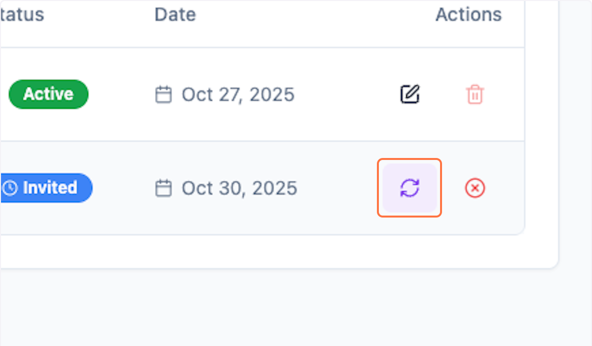

# Team: Manage in Packwares CMS

## # [Packwares CMS](https://cms.packwares.com/settings/team)

### 1. Click on Setting > Team

### 2. Preview available Team Members…

### 3. To Add new used, click on Invite User

### 4. Enter Member email ID

### 5. Click on Send Invitation

The team member will receive an email invite to join your team.

### 6. Notifications confirms that the email is sent

### 7. Preview recently added team member

Add unlimited team members — status updates only after they accept the invite.

### 8. Click the refresh icon to send them a reminder.

 