# Setting: Manage User Roles in Packwares CMS

## # [Packwares CMS](https://cms.packwares.com/settings/user-roles)

### 1. Click on Settings > User Roles
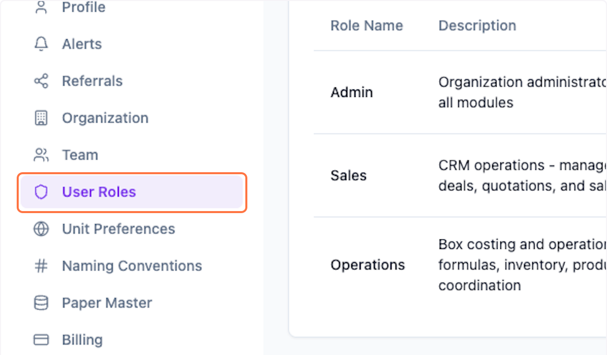

### 2. Preview Existing User Roles Management…

You can customize the roles and access for each role.

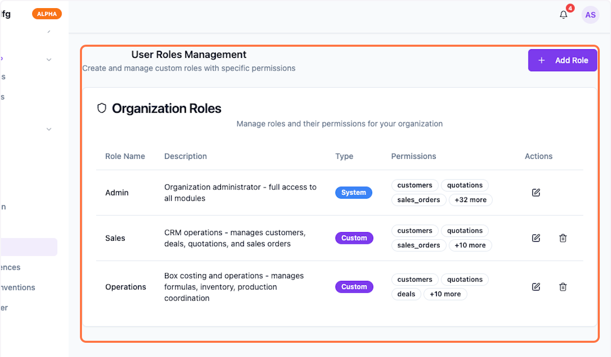

### 3. Click on Pencil icon to edit the specifc role
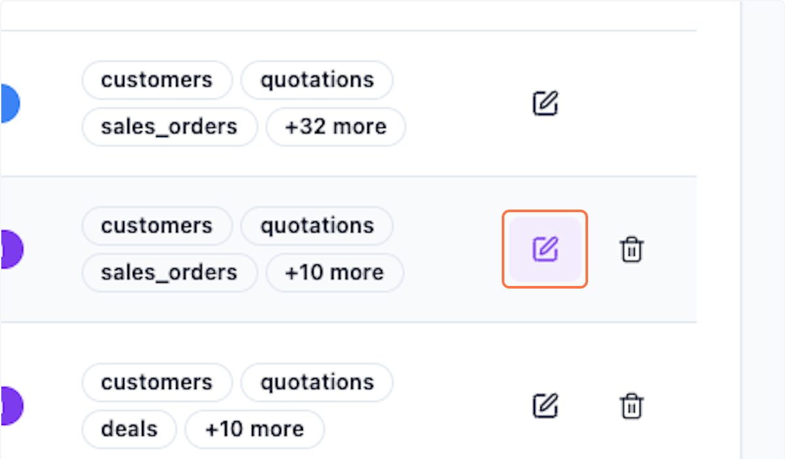

### 4. Rename as your internal department role
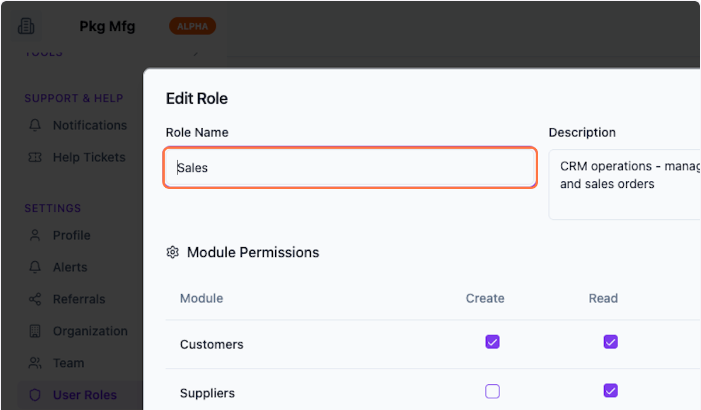

### 5. Update Description
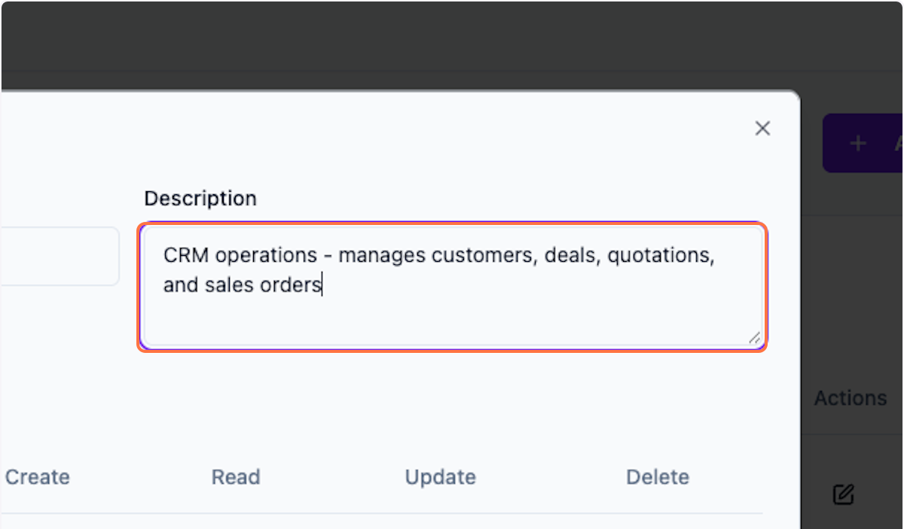

### 6. Check / Uncheck page wise permissions

### 7. Click on Update Role
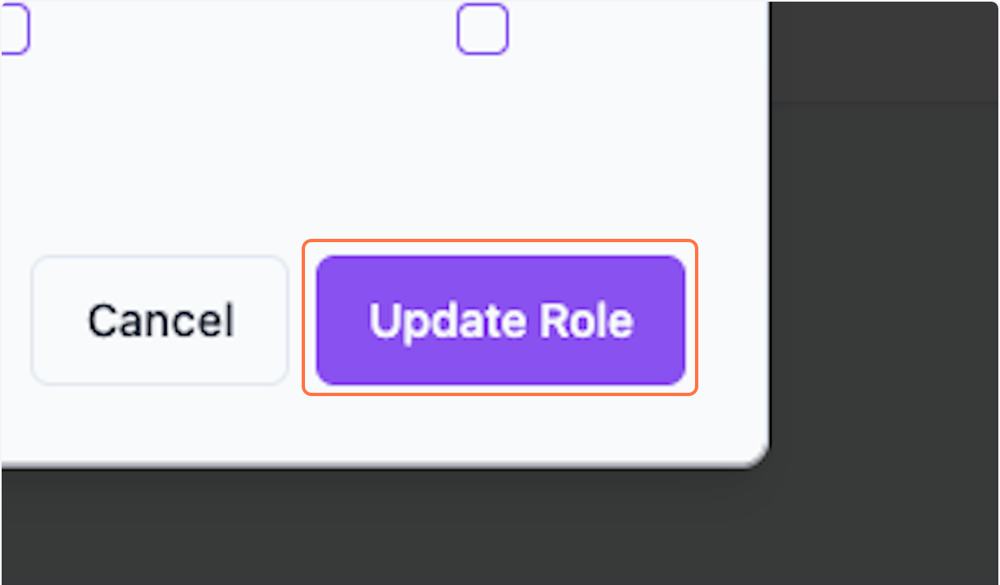

### 8. Create new user role

### 9. Click on Add Role

### 10. Enter Role Name
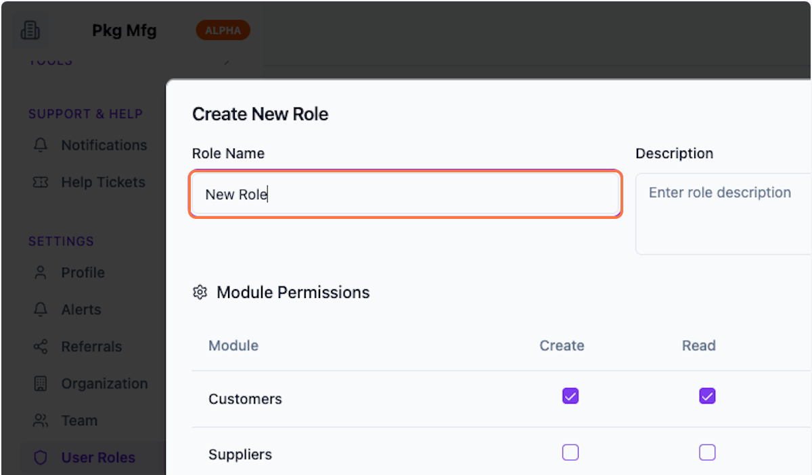

### 11. Enter Description
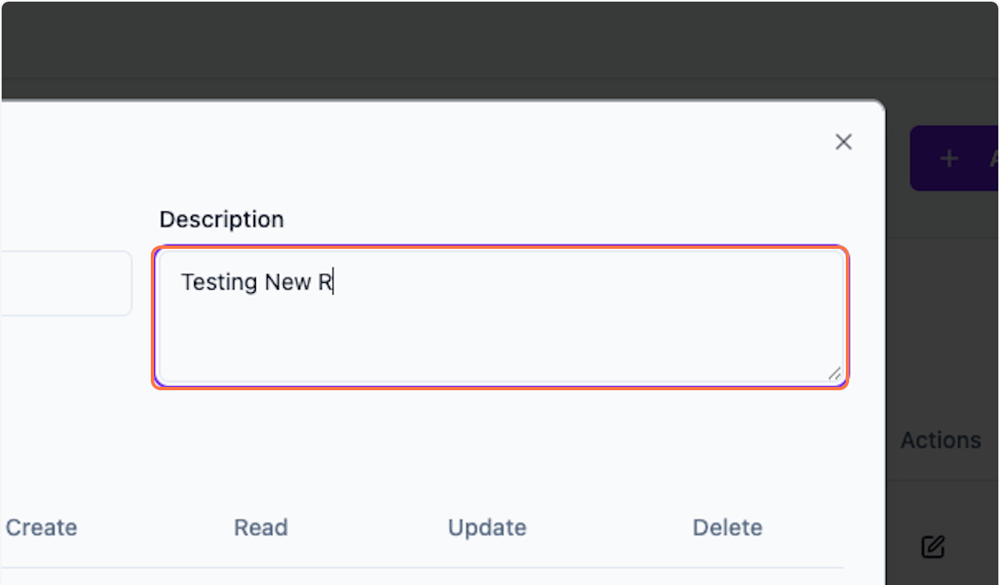

### 12. Give desires permissions
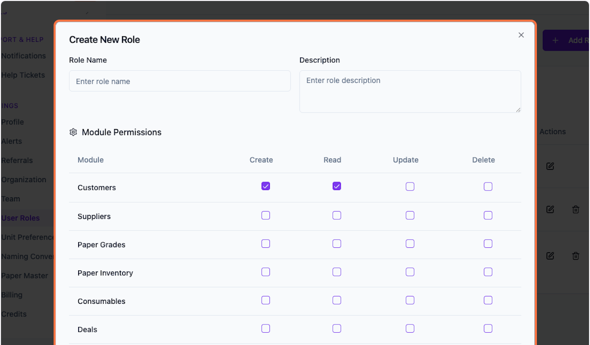

### 13. Click on Create Role
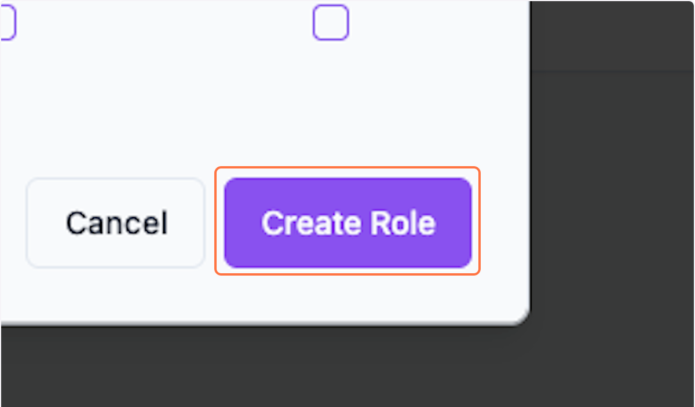

### 14. Preview the Newly created role "New role"
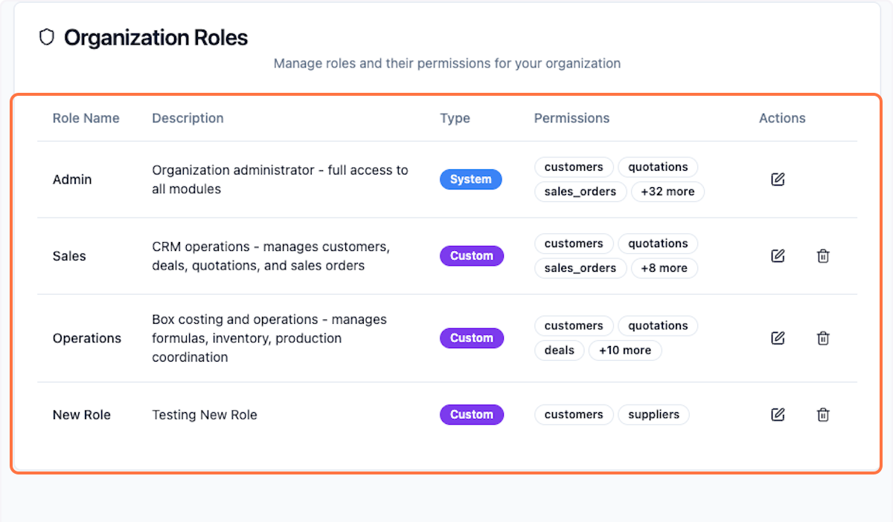

 