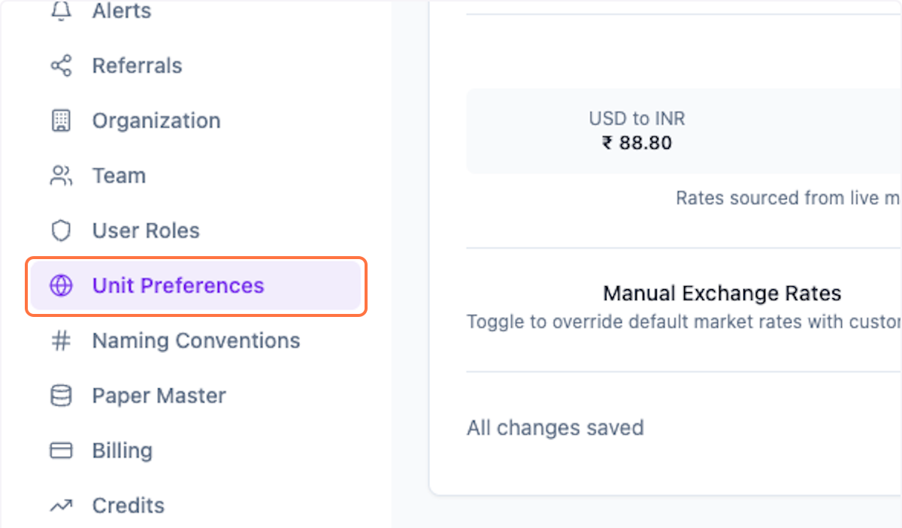
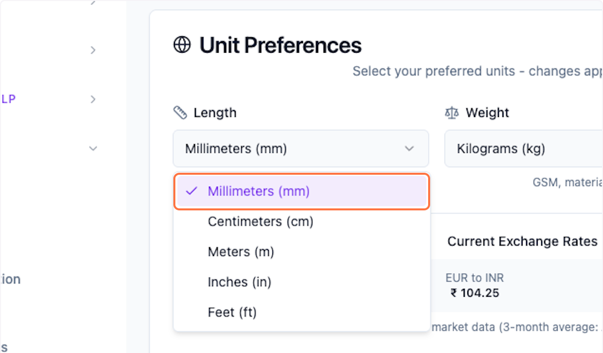
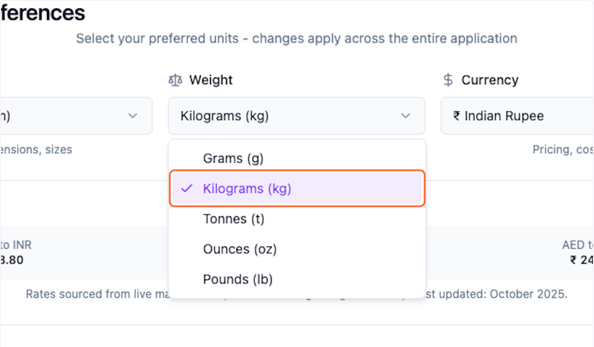
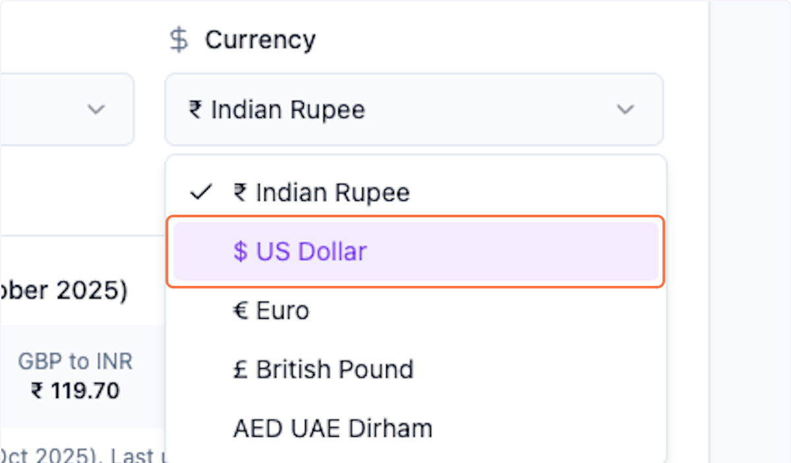
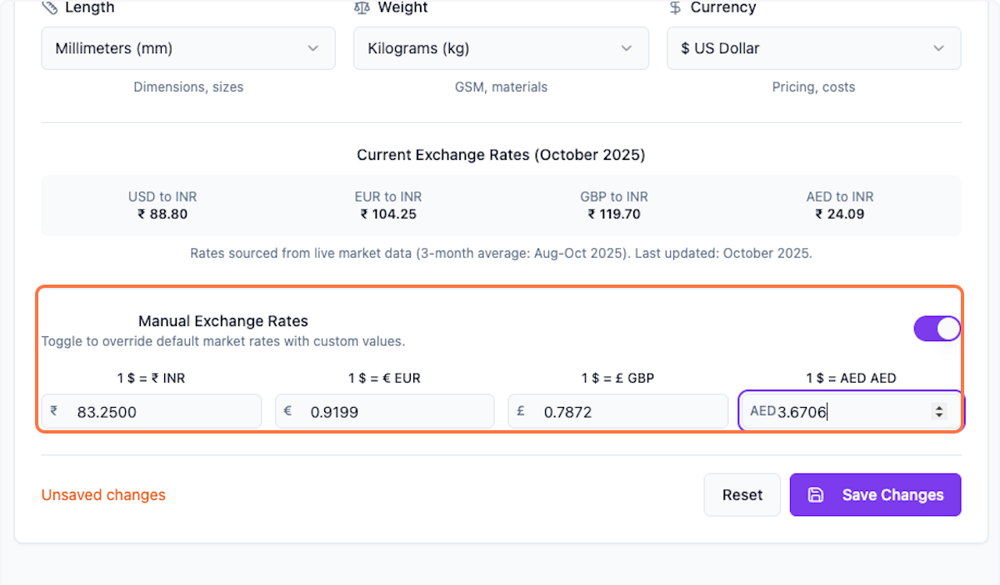
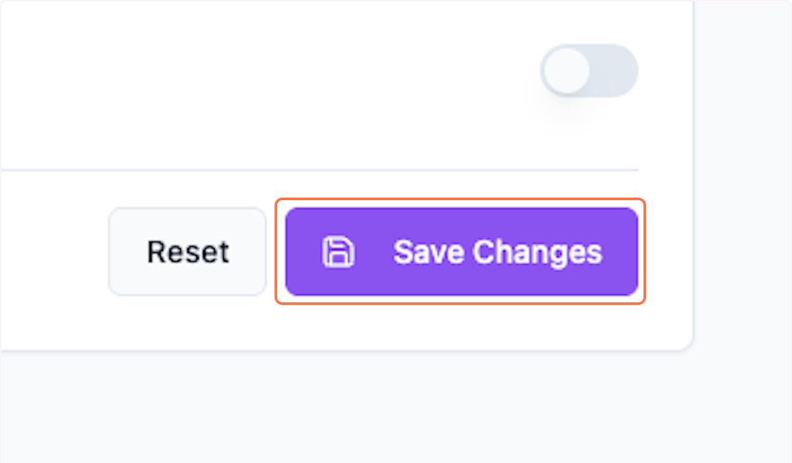

# Settings: UOM, Configure Unit Preferences in Packwares CMS

## # [Packwares CMS](https://cms.packwares.com/settings/unit-preferences)

### 1. Click on Settings > Unit Preferences

### 2. Update Length UoM

### 3. Update Weight UoM

### 4. Update Currency UoM

### 5. Update Manual Exchange Rates…

This is optional

### 6. Click on Save Changes

 