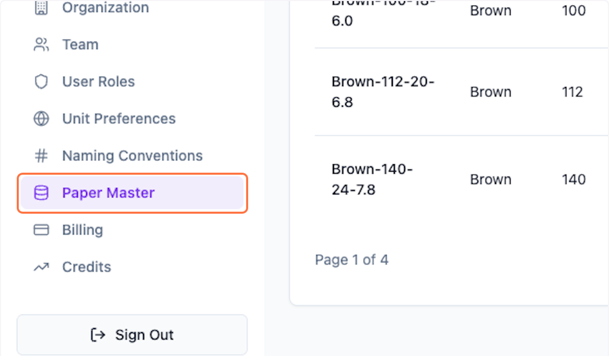
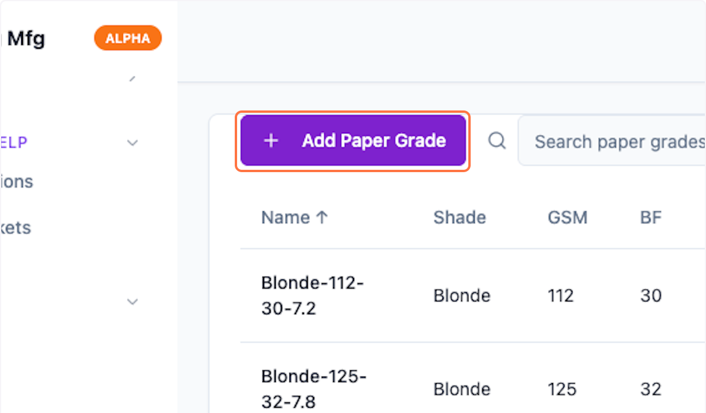
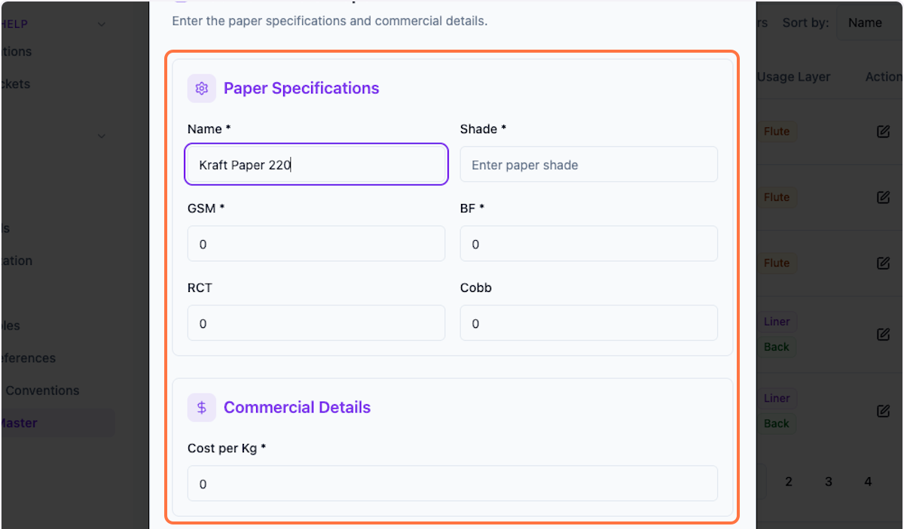
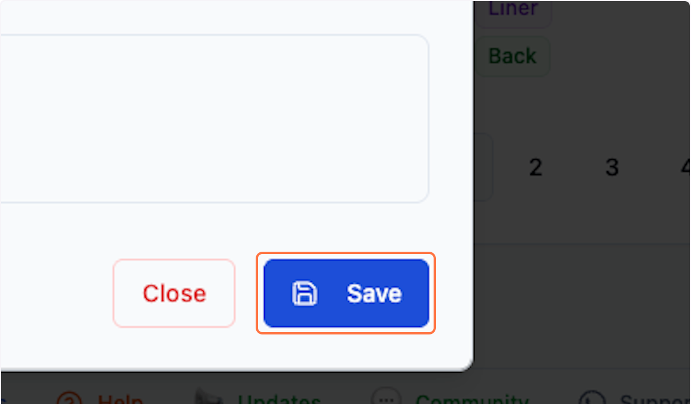
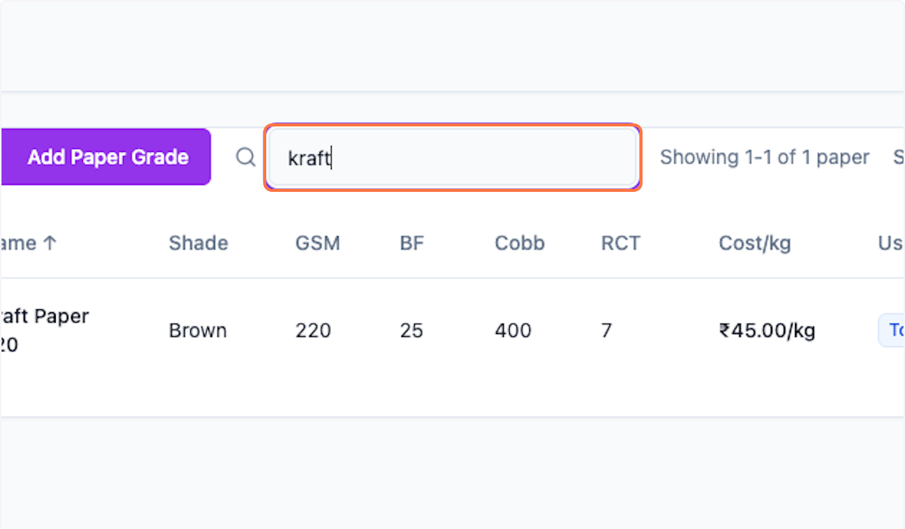
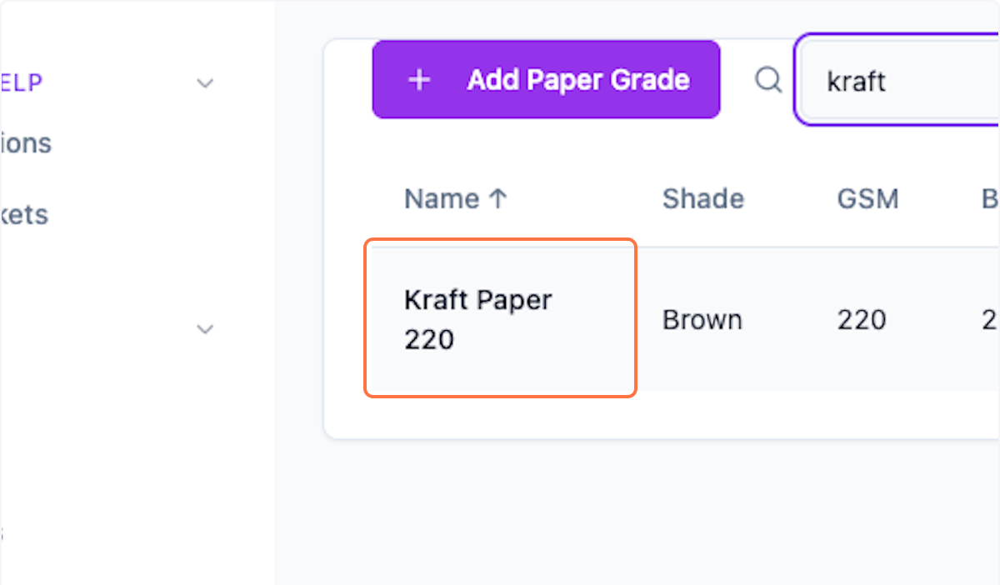

# Setting: Add Paper Grade in Packwares CMS

These master paper which are required to run costing and also manage the inventory

## # [Packwares CMS](https://cms.packwares.com/settings/paper-master)

### 1. Click on Settings > Paper Master

### 2. Click on Add Paper Grade

### 3. Enter all the necessary details in the form

### 4. Click on Save

### 5. Preview the Paper Grade using search filter

### 6. Recently created Paper Grade

 