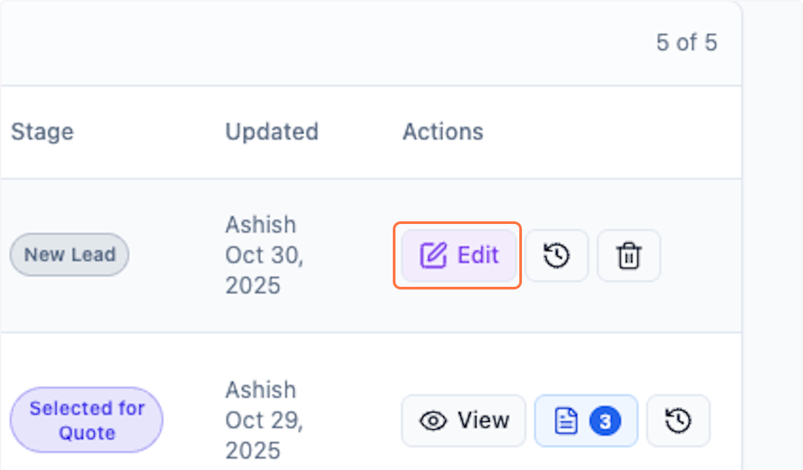
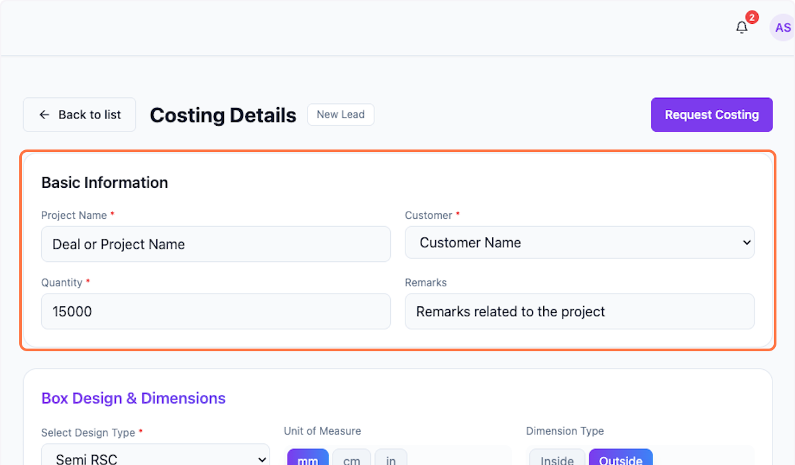
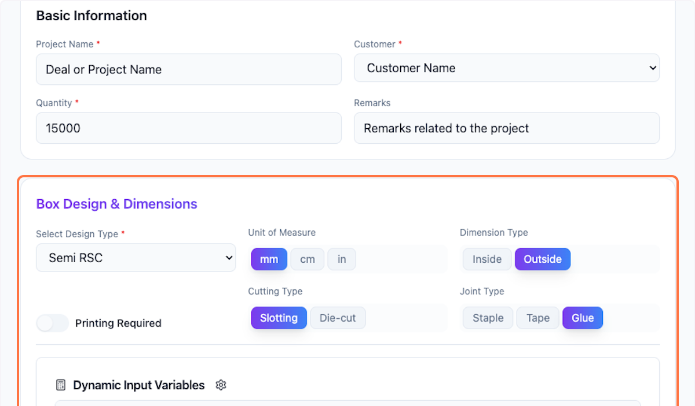
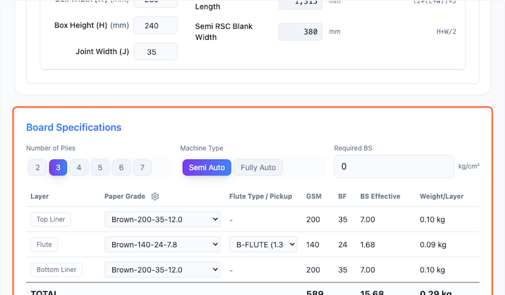
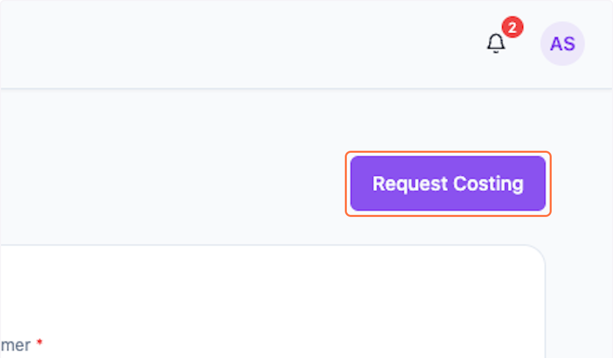
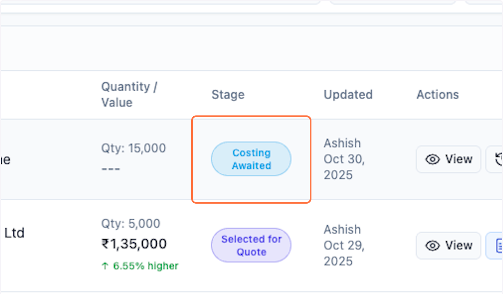

# Request Box Costing in Packwares CMS

This requires a deal with status 'New Lead' to already exist.

## # [Packwares CMS](https://cms.packwares.com/manufacturer/deals)

### 1. Click on Edit

### 2. Click on Basic Information…

Double-check that everything's in place and ready to go.

### 3. Click on Box Design & Dimensions…

Double-check that everything's in place and ready to go.

### 4. Click on Board Specifications…

### 5. Click on Request Costing

This initiates the costing request to the right person.

### 6. Click on Costing Awaited

You can see the status change in the list. This record is now read-only — you can view it but can't make changes.

## # You'll need to follow up with the costing person to finish the costing before moving to quotation creation.

 