# Create and Download Quotation in Packwares CMS

## # [Packwares CMS](https://cms.packwares.com/manufacturer/deals)

### 1. On Deals page > Click on All Stages
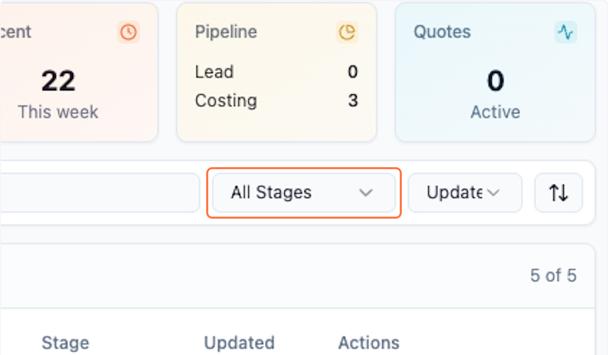

### 2. Click on Costing Received

This status will only show you the deals where you need to take actions.

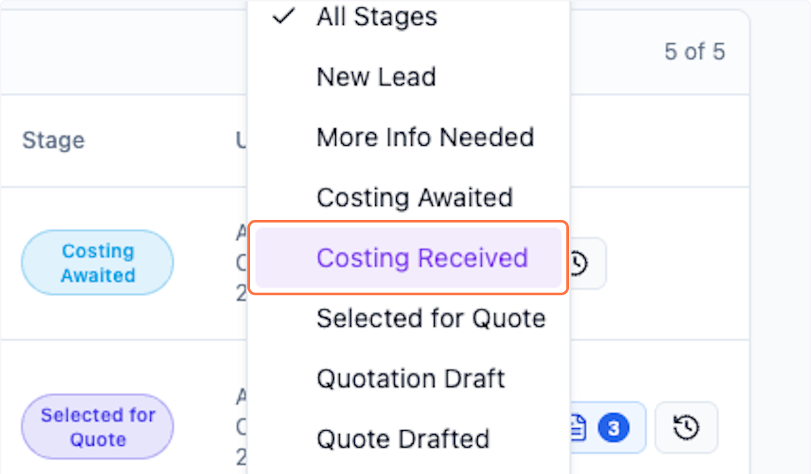

### 3. Click on Deals…

You can now see all the deals pending for your action and quote to customer

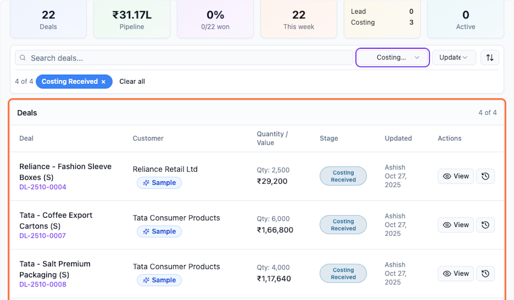

### 4. Click on View
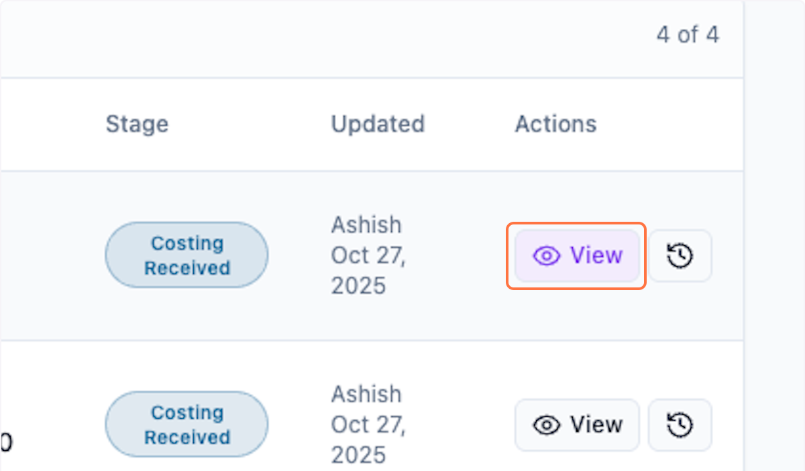

### 5. Check the price received
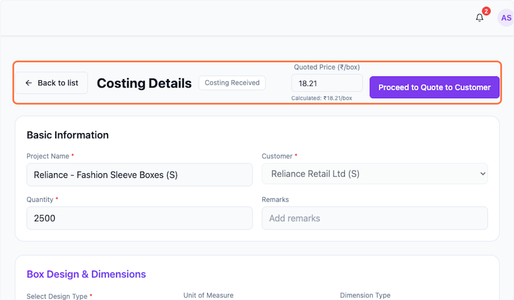

### 6. You can edit the price as well
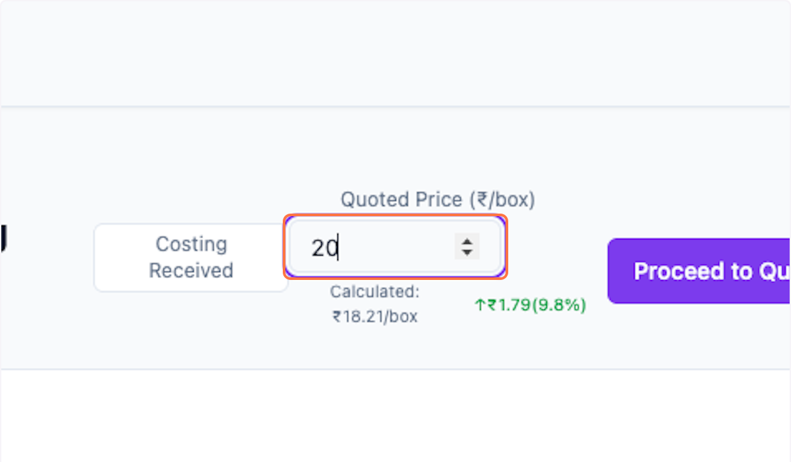

### 7. Check for correctness 

Check again if everything is correct as per customer request

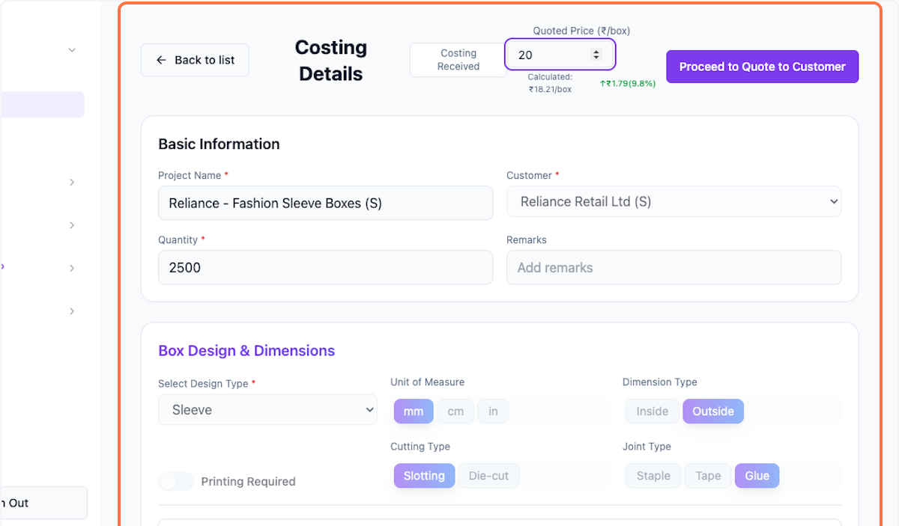

### 8. Click on Proceed to Quote to Customer

Once you are satisfied then proceed to quote to customer.

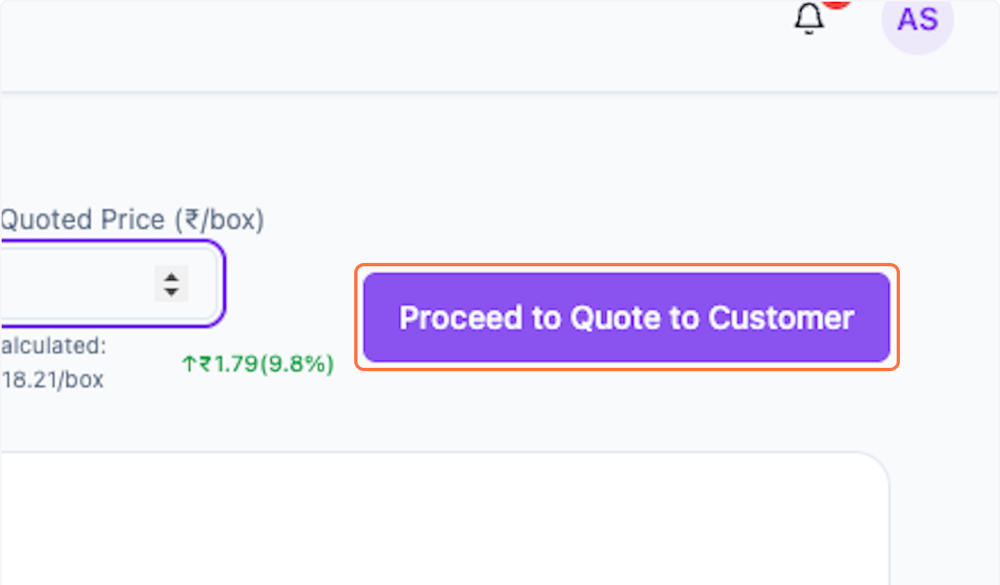

### 9. This opens a popup window

Please check all the detaills

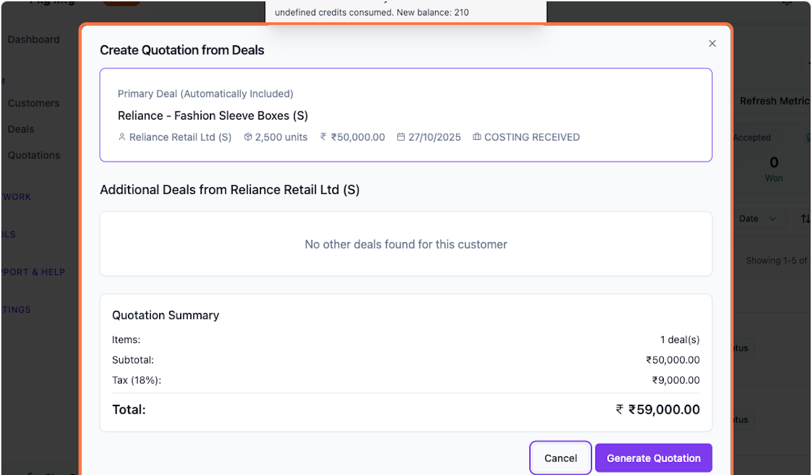

### 10. These are your deal details

The Additional Deals from same customer are also showing below, this will give you convenience to also club them in one quotation. You can add multiple deals to the one quotation.

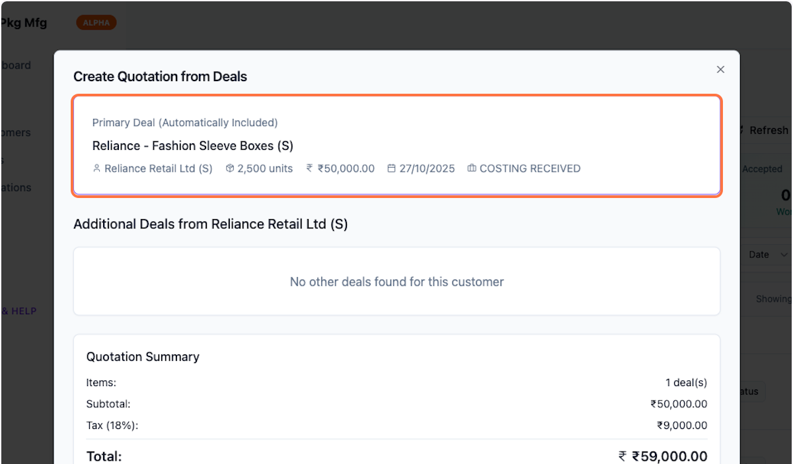

### 11. Check correctness of numbers
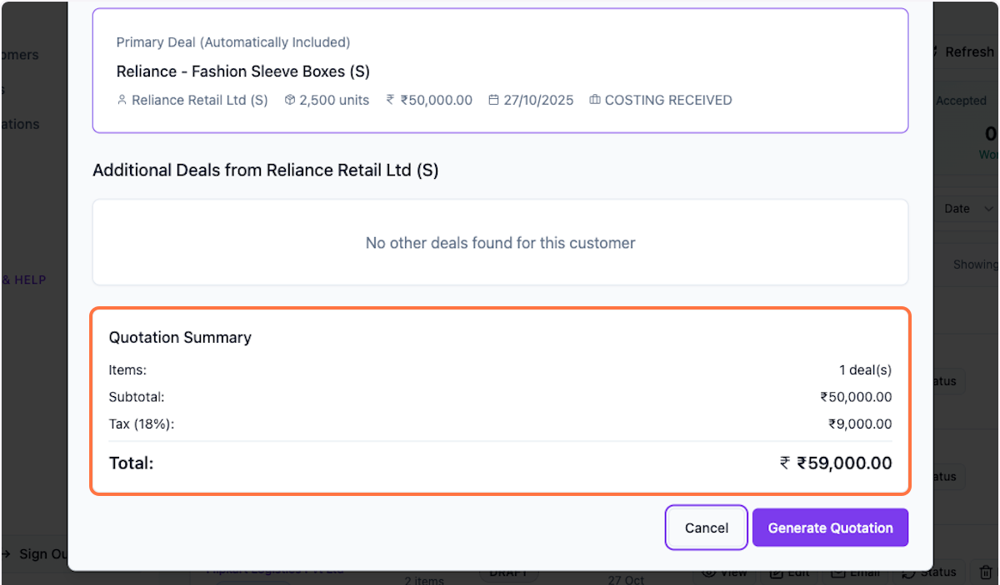

### 12. Click on Generate Quotation

Once you are satisfied the Generate Quotation

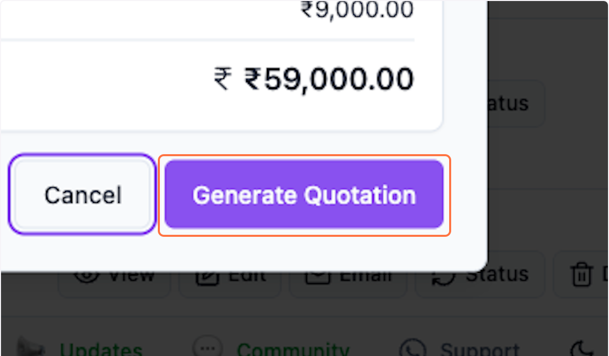

### 13. You will now see a Quotation Preview…

Check all the details

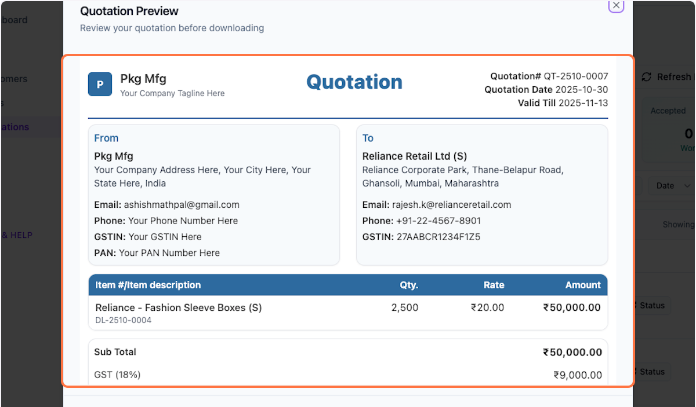

### 14. Scroll down to see full details

Update Terms and Conditions and Bank Details in settings for them to display correctly.

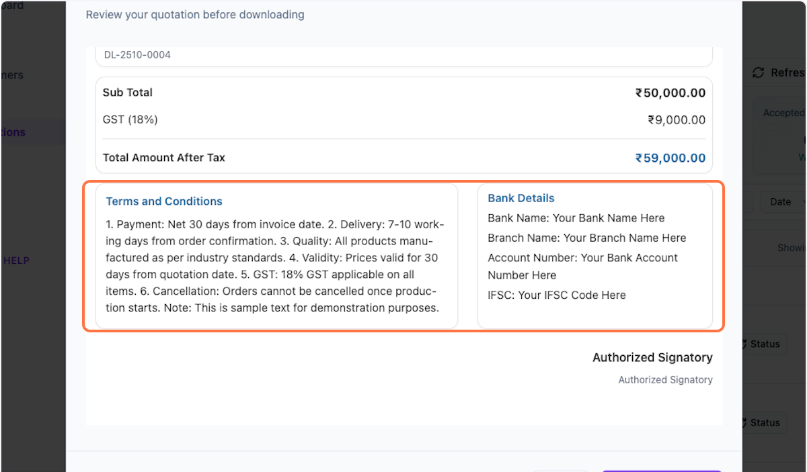

### 15. Click on Download PDF

You can use this file to share with your customer via email.

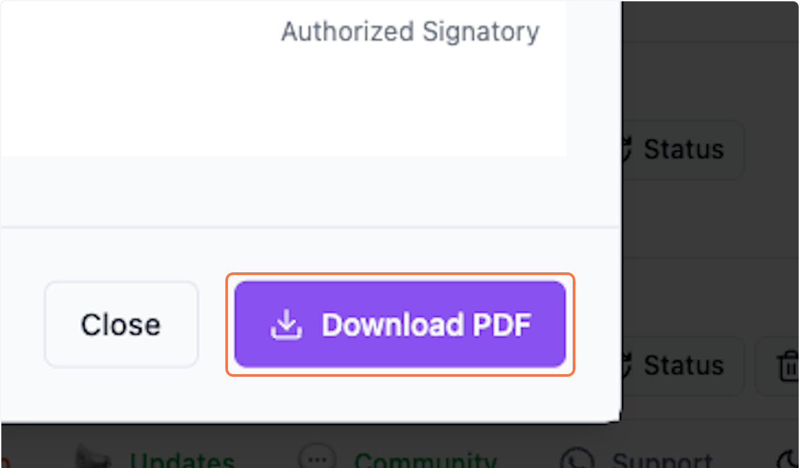

### 16. Click on Close
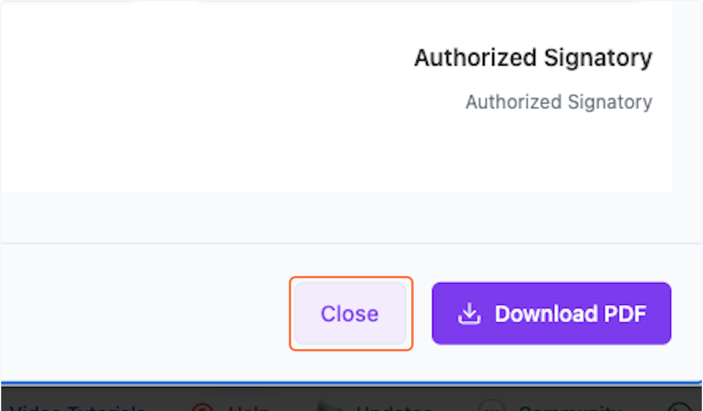

### 17. View Your Quotations

Refresh your browser (Ctrl+F5) to see the latest list.

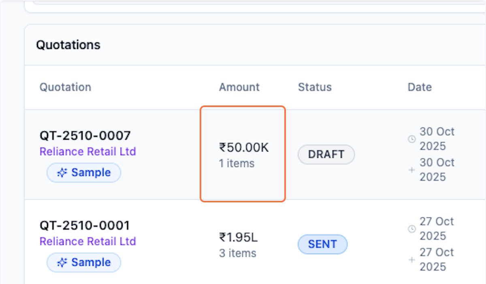

 