# Quotation: Update and Finalize Status in Packwares CMS

## # [Packwares CMS](https://cms.packwares.com/manufacturer/quotations)

### 1. On Quotation Page, click on Edit
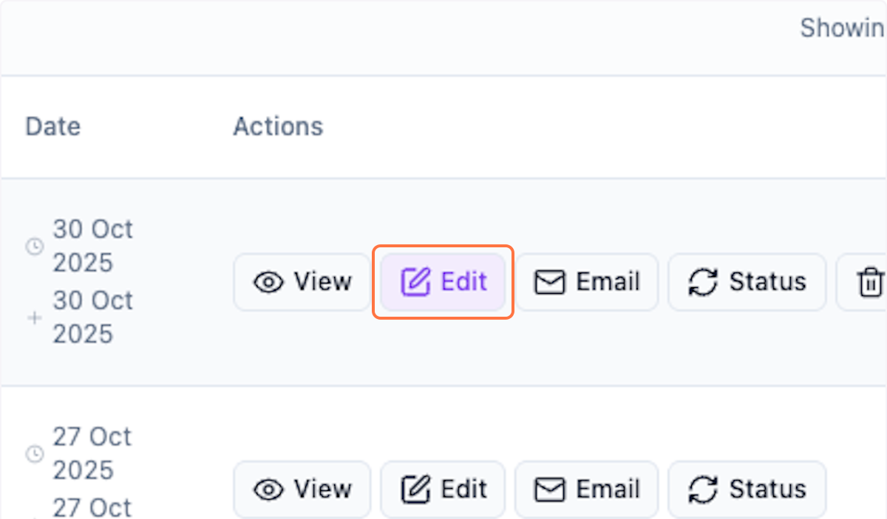

### 2. Quotation opened in edit mode.

Check for warnings if settings aren't updated.

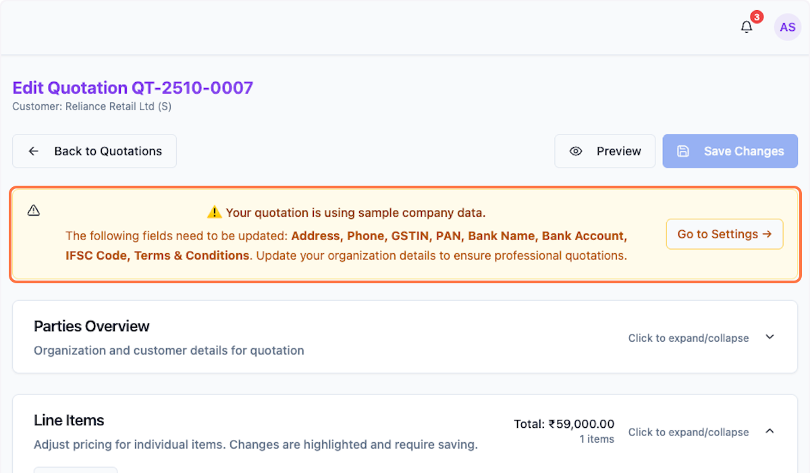

### 3. Parties Overview: Review and Update Details

Update anything that needs correction.

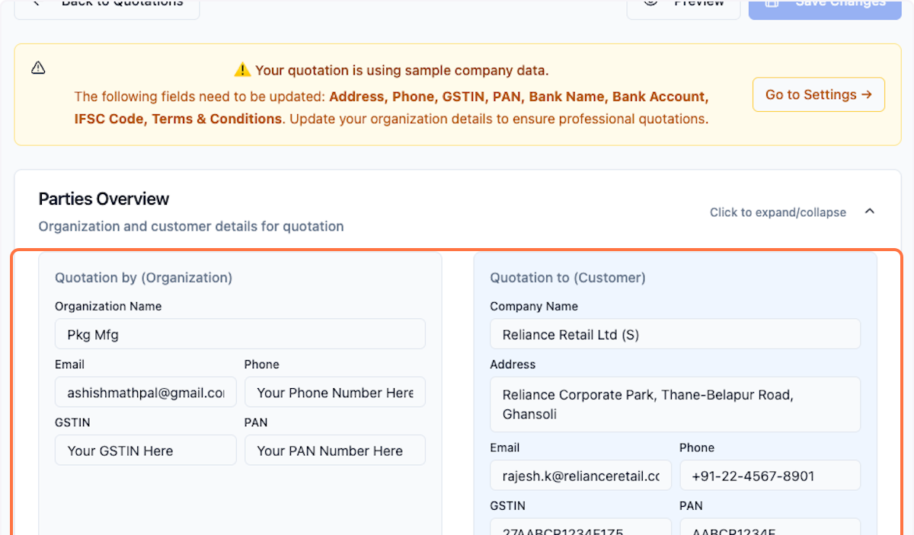

### 4. Verify Details

Check for correctness and update if required.

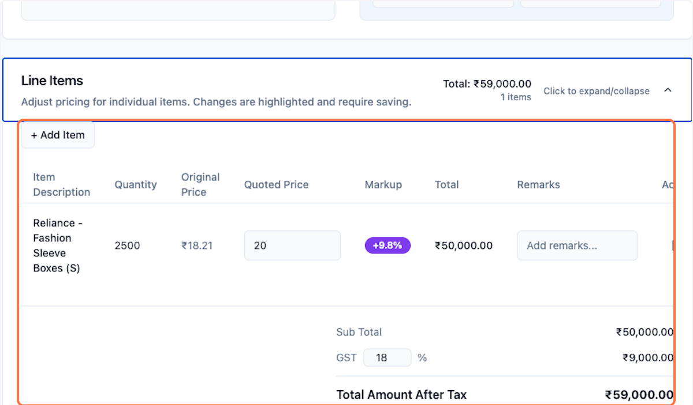

### 5. Update price if required
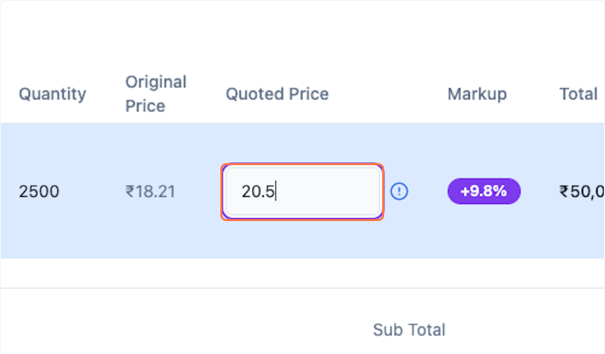

### 6. Update Terms and Conditions & Bank Details

Click to update with correct information.

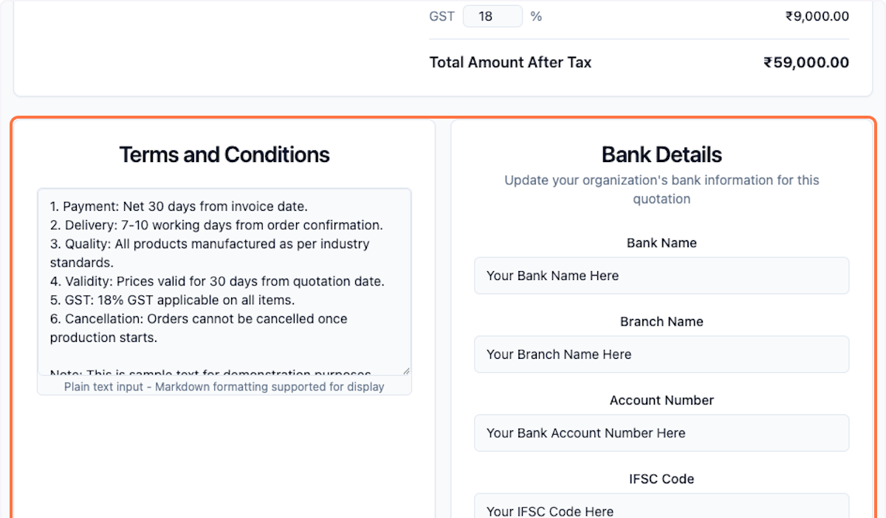

### 7. Click on Save Changes
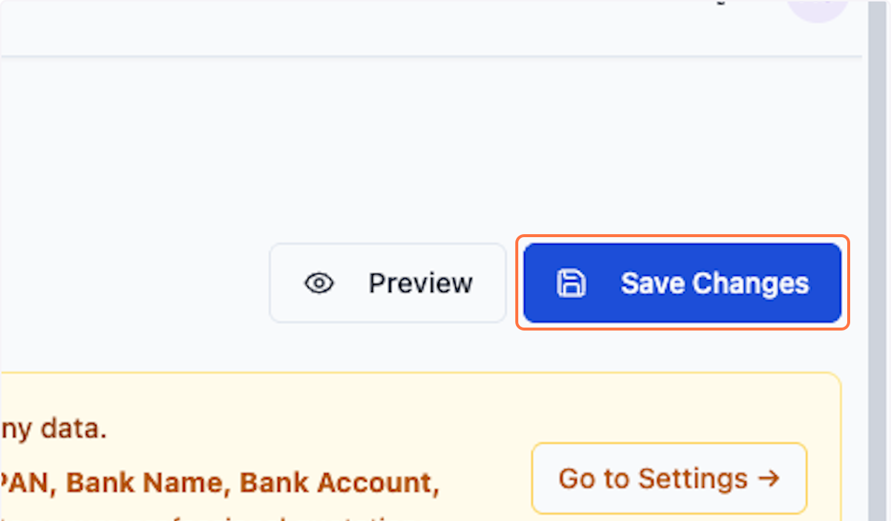

### 8. Scroll up and Preview the updates. 
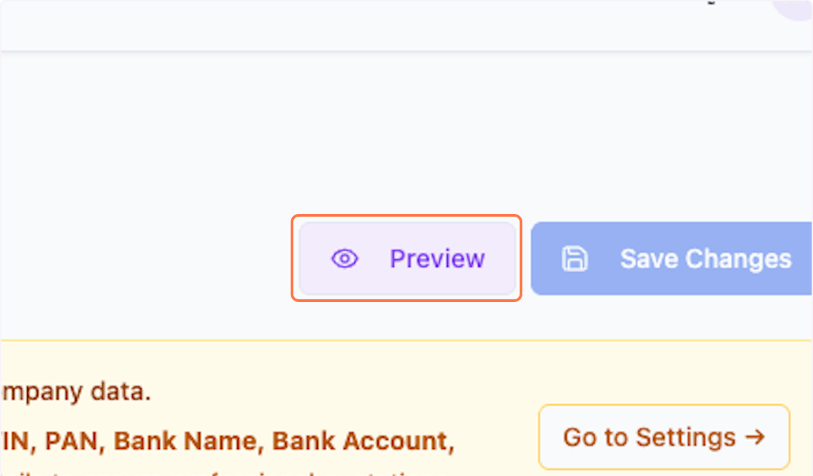

### 9. Click on Quotation Preview…
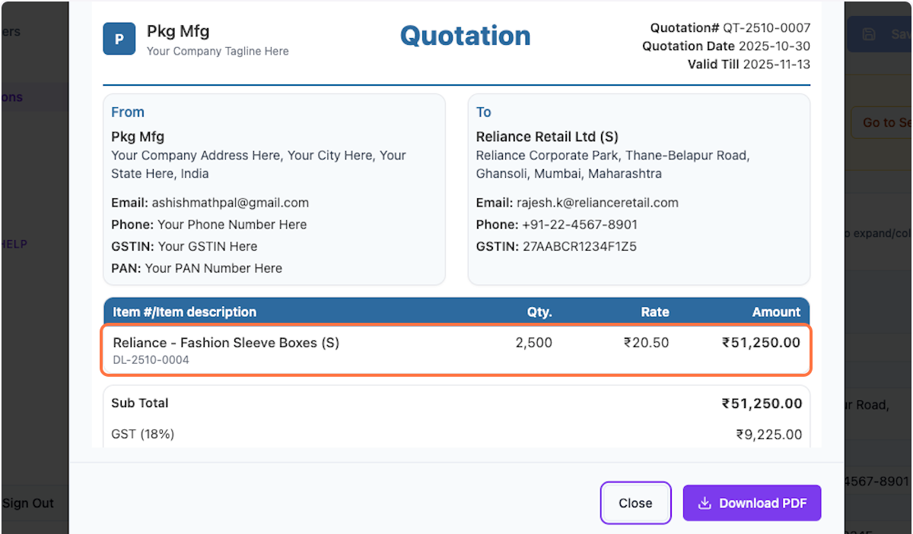

### 10. Click on Close
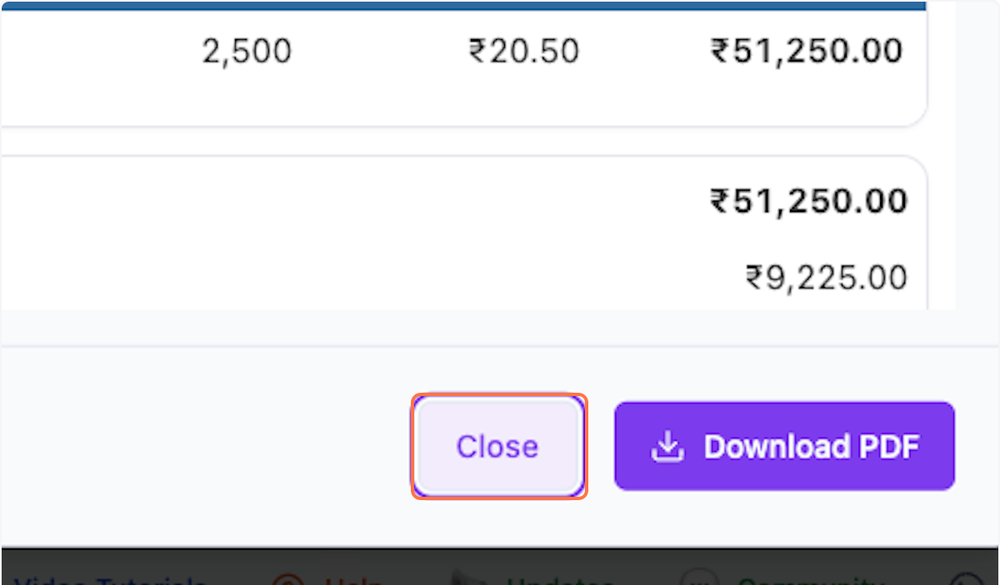

### 11. Click on Back to Quotations
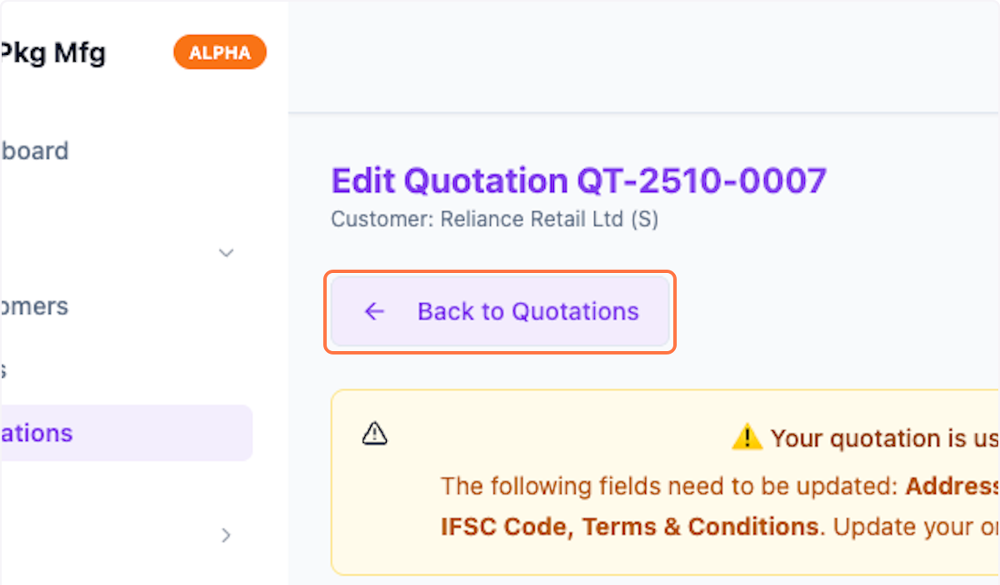

### 12. Click on Status
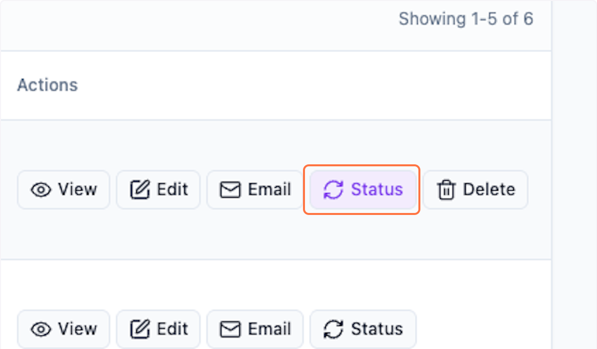

### 13. Select "Ready" form the dropdown

You can choose status as per your choice.

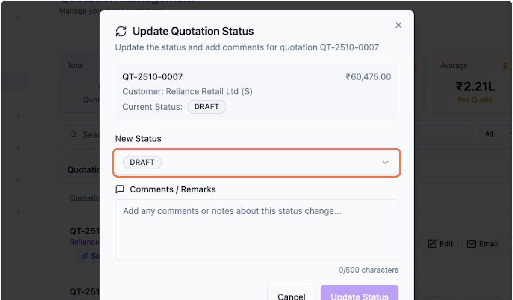

### 14. Update Comments
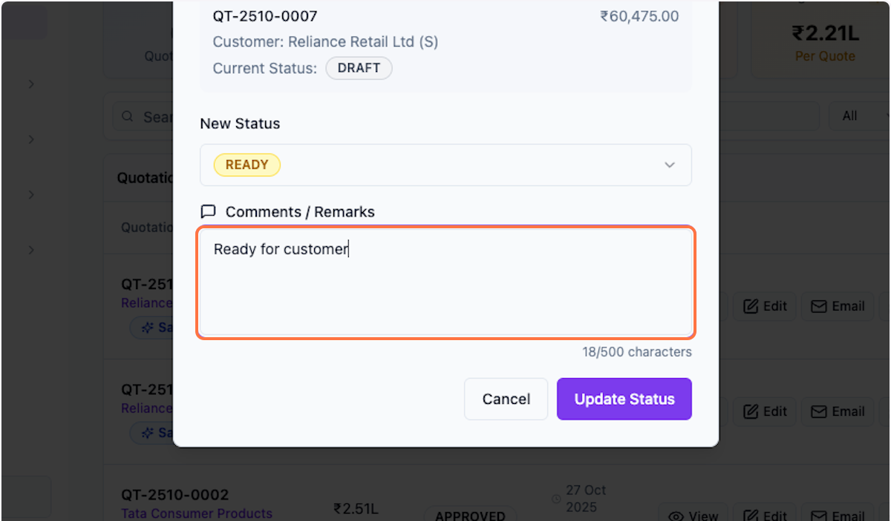

### 15. Click on Update Status
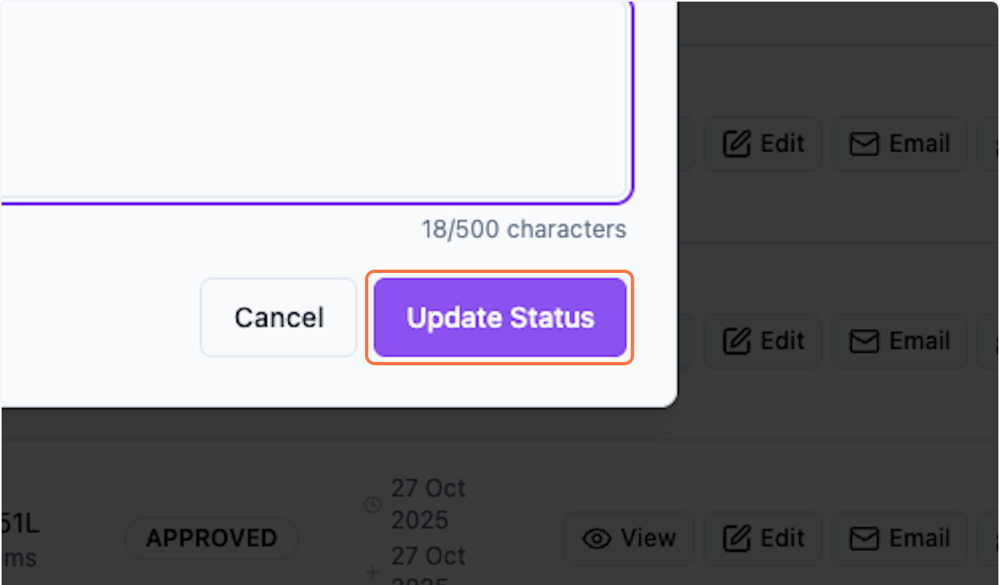

### 16. Review Quotation List

Check the quotation with updated details and status.

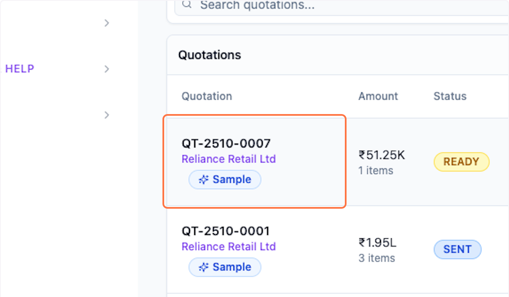

 