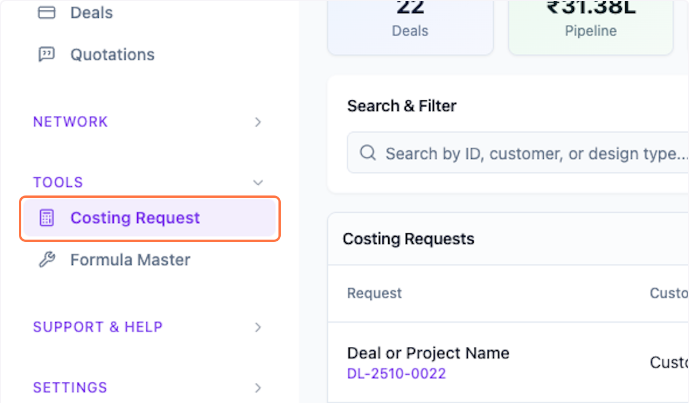
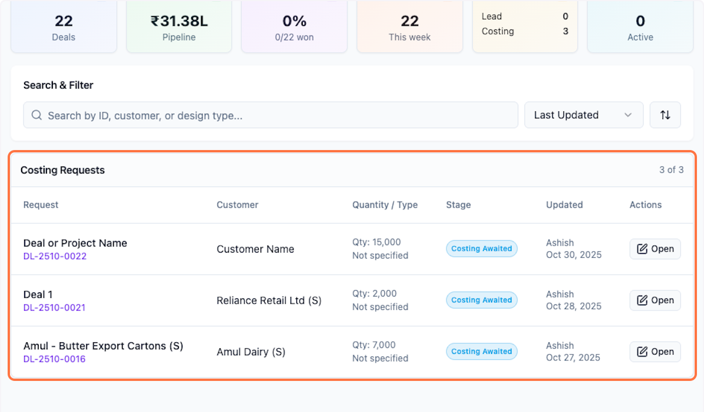
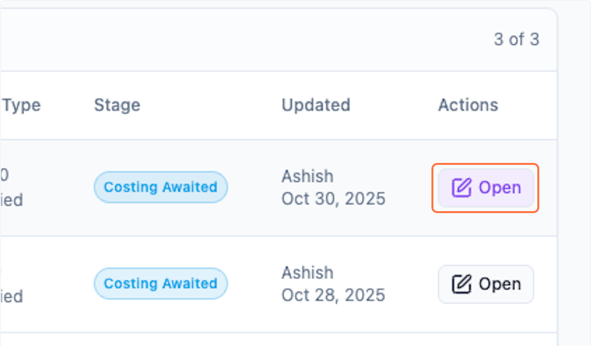
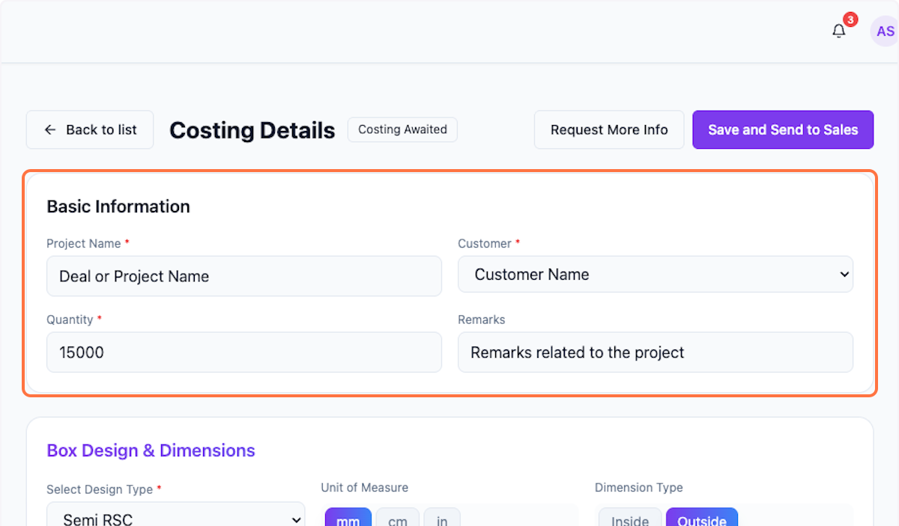
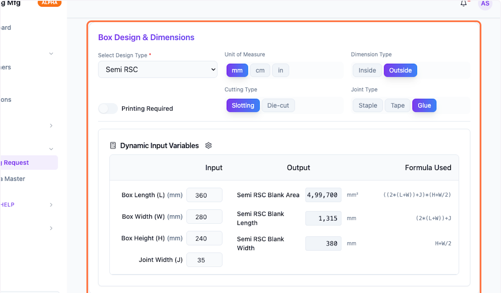
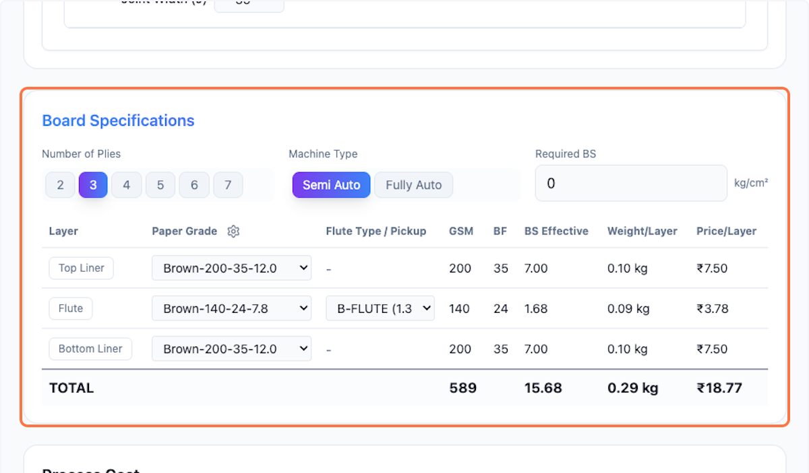
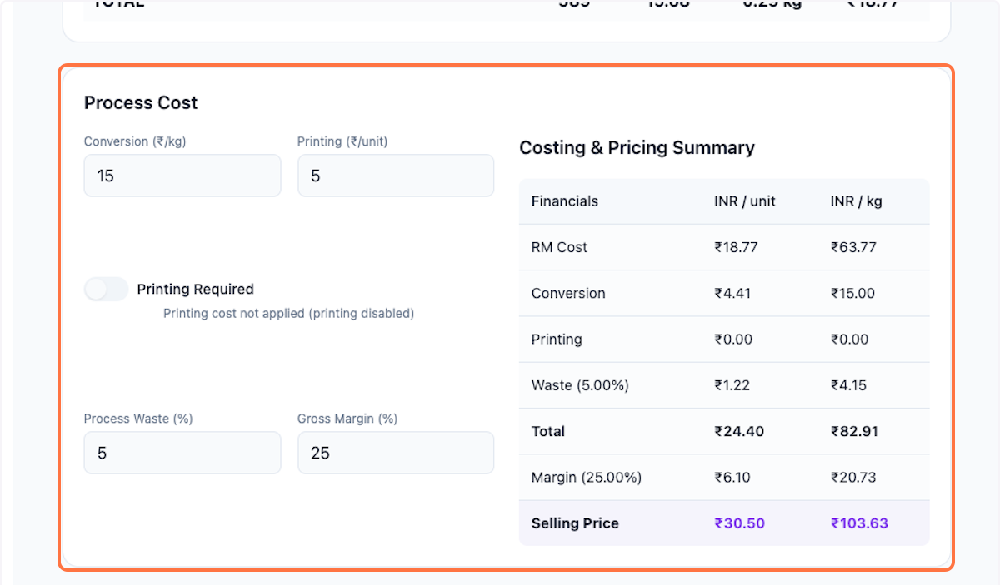
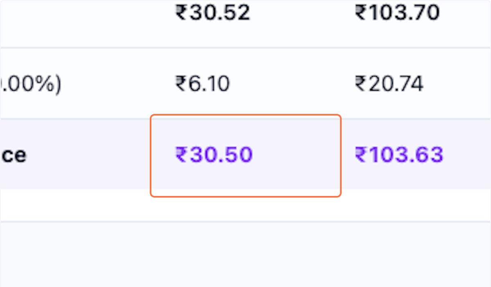
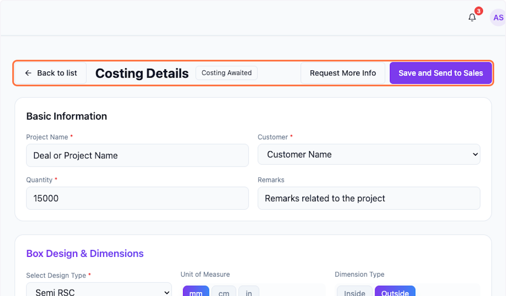

# Process Costing Request in Packwares CMS

## # [Packwares CMS](https://cms.packwares.com/manufacturer/costing-request)

### 1. Click on Costing Request

### 2. View List of Request Pending for your action

### 3. Open the one you want to work on

### 4. Check Basic Information…

### 5. Check Box Design & Dimensions…

Edit if required

### 6. Check Box Design & Dimensions…

Edit if required

### 7. Check Board Specifications…

Edit if required

### 8. Check and update Process Cost…

### 9. Review the final price 

### 10. Scroll up "Save and Send to Sales"

 