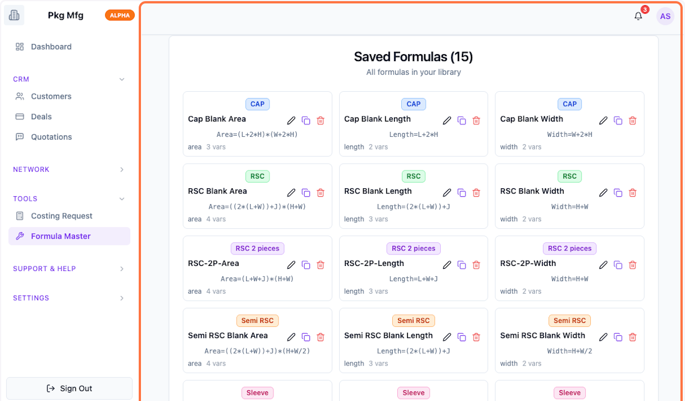
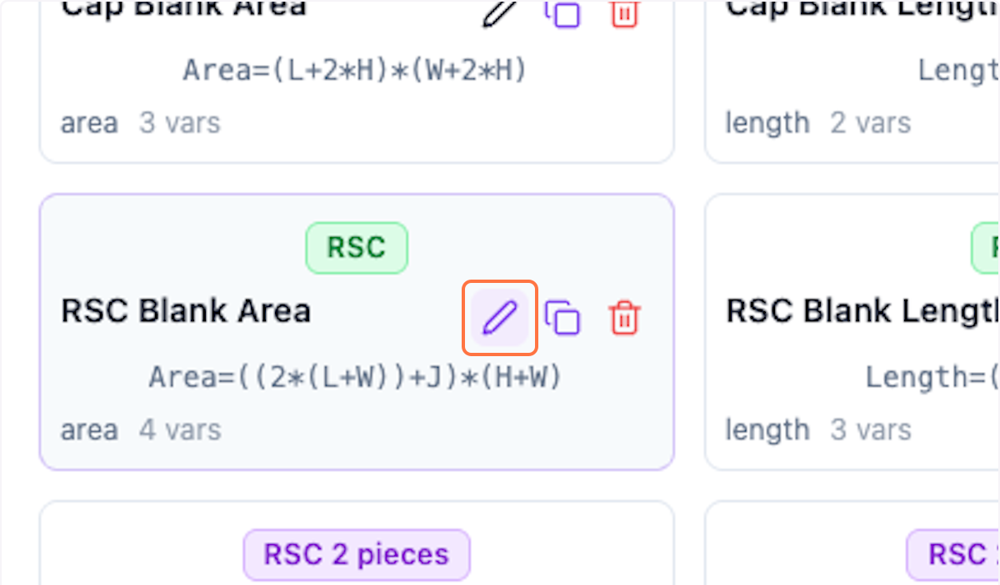
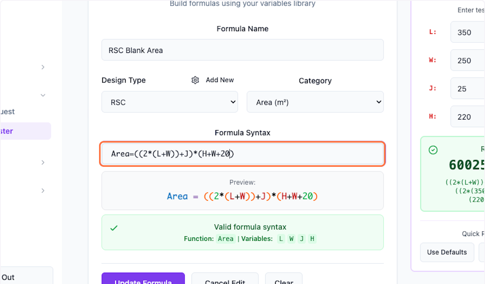
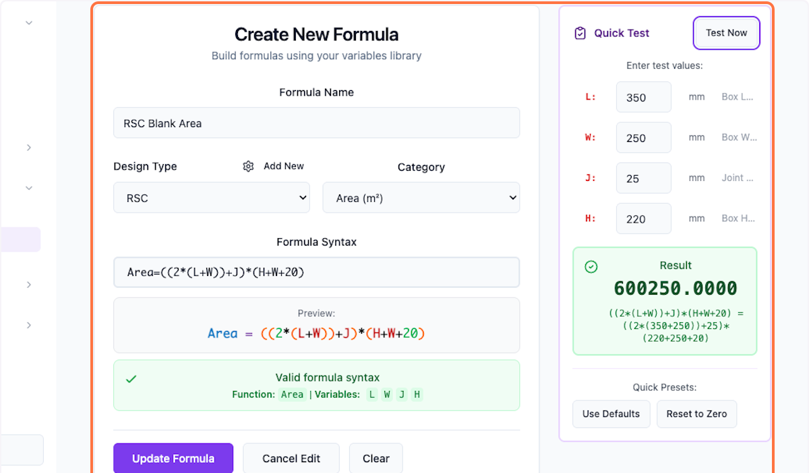
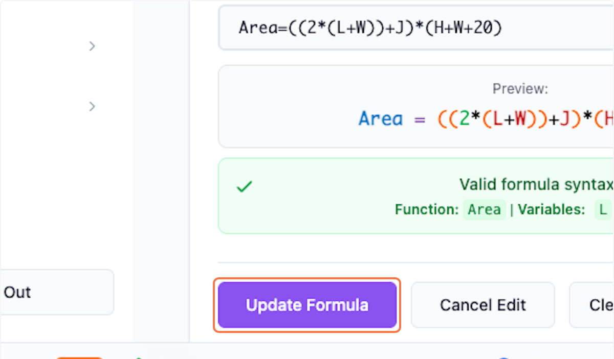
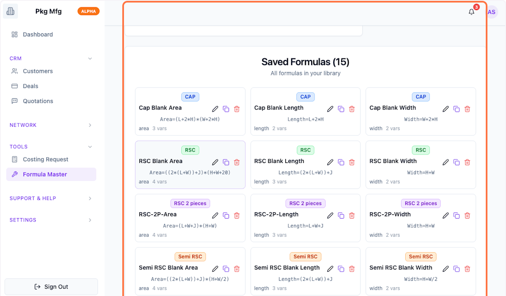

# Formula: Update and Customise in Packwares CMS

You can customize the existing formulas as per your internal standards.

## # [Packwares CMS](https://cms.packwares.com/formula-master/formulas)

### 1. Click on Formula Master

### 2. Scroll down to see the existing formulas

The system includes popular common formulas.

### 3. Click on pencil icon to edit any formula

### 4. Scroll up to see the formula in edit mode

### 5. Make changes to customize.

### 6. You can test the formula with right side panel. 

### 7. Click on Update Formula to save the changes

### 8. You can preview the chnages done 

 