# Variables: Update + Create + Delete in Packwares CMS

## # [Packwares CMS](https://cms.packwares.com/formula-master/formulas)

### 1. Click on Formula Master
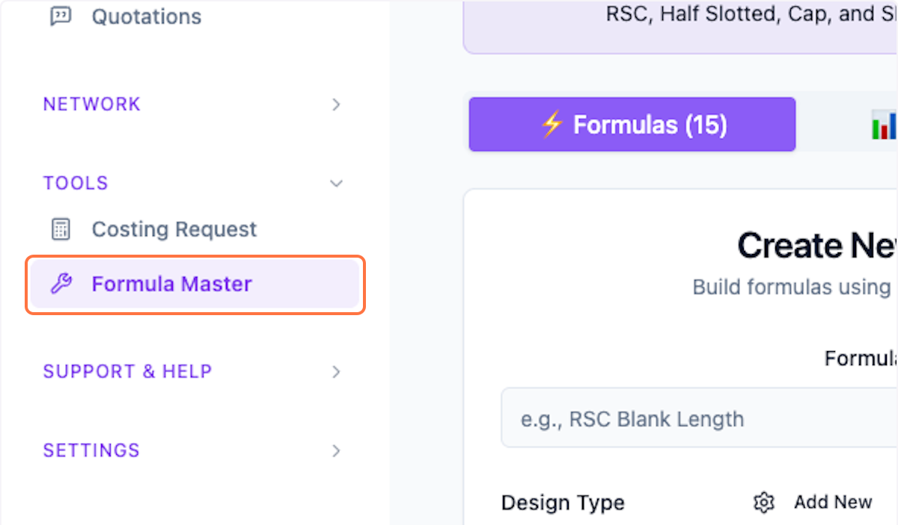

### 2. Click on 📊 Variables Tab

The number 4 indicates the total number of variables.

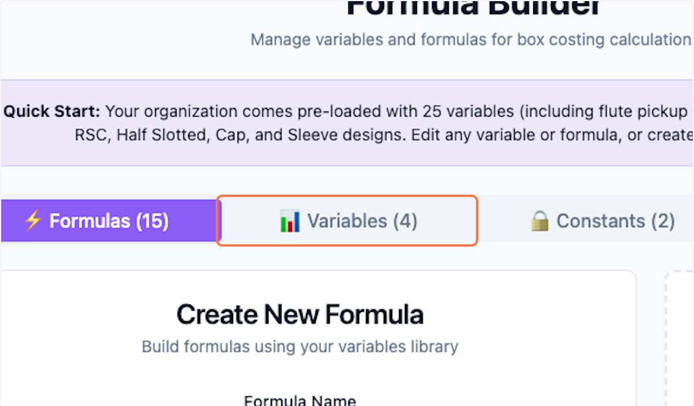

### 3. View all existing Variables
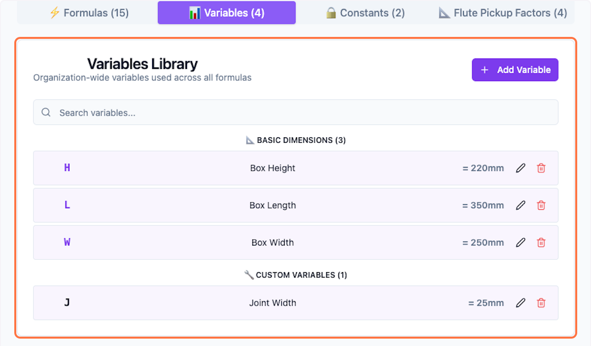

### 4. Click on pencil icon to edit Variables
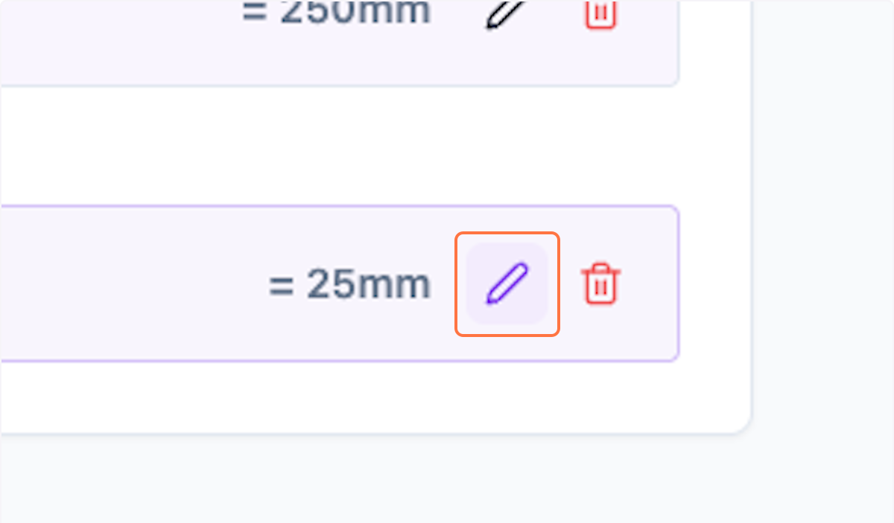

### 5. Update the values
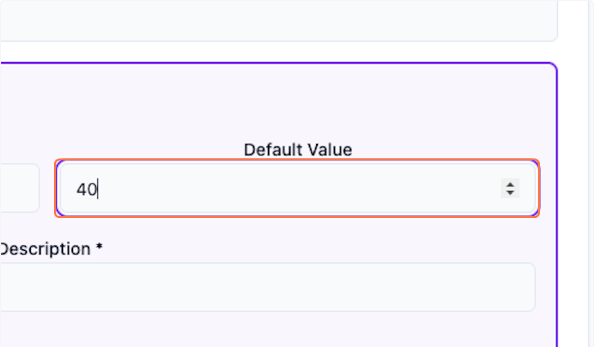

### 6. Click on Update to save
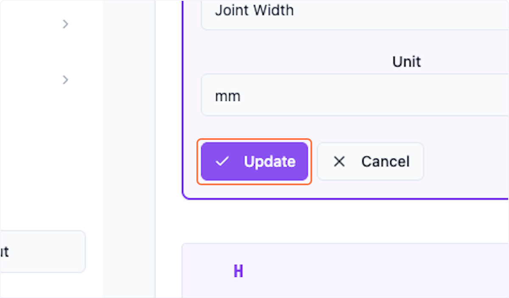

## # Create New Variable
You can also create new variables of your choice

### 7. Click on Add Variable
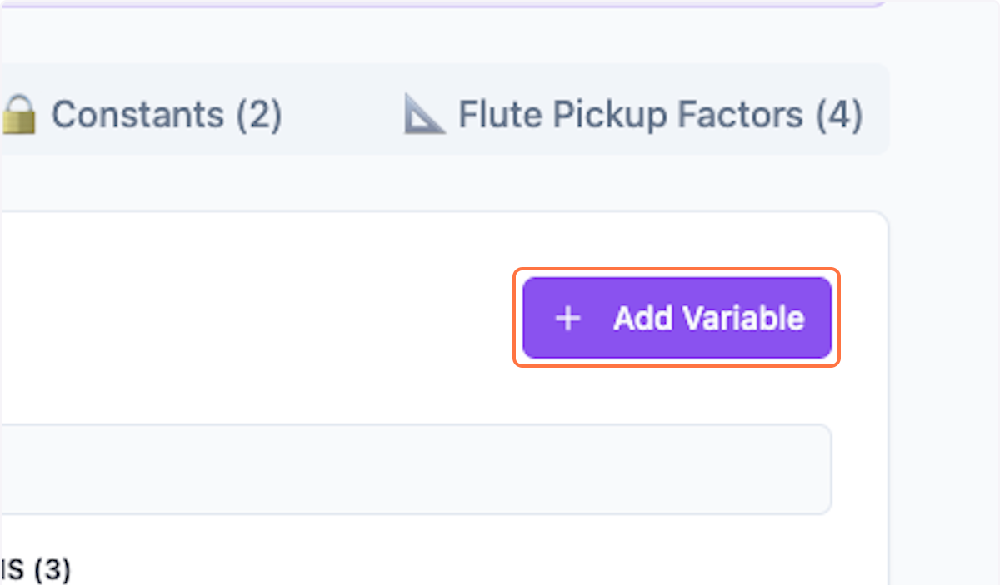

### 8. Update all the fields

Symbol, Default value, Description and Unit of measure

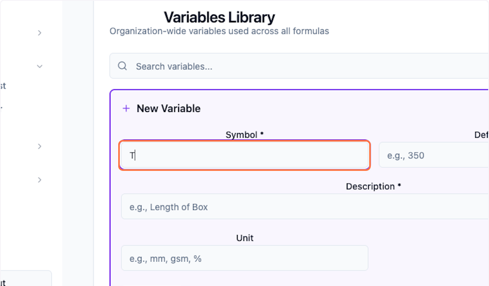

### 9. Click on Create
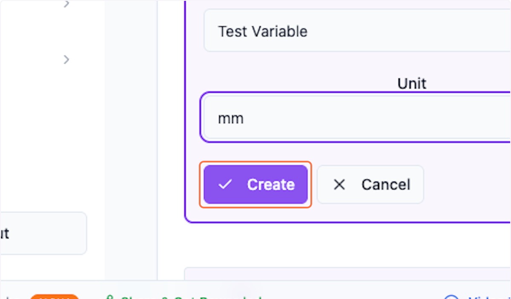

### 10. You can view the variable at the bottom.
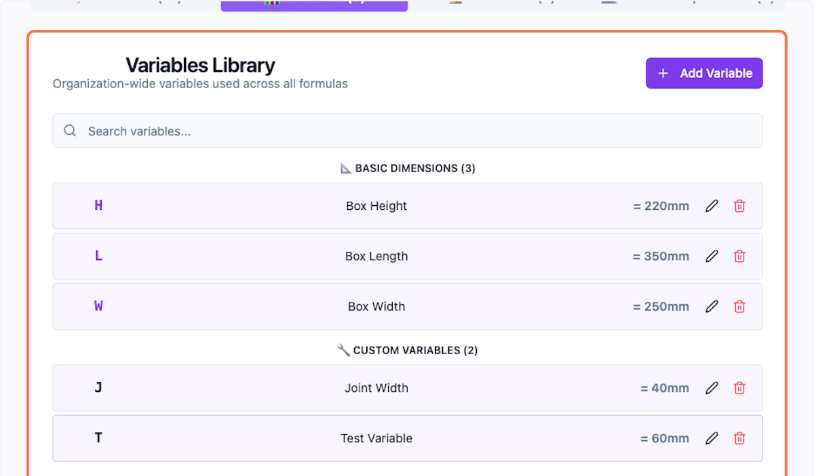

### 11. You can similarly delete any variable
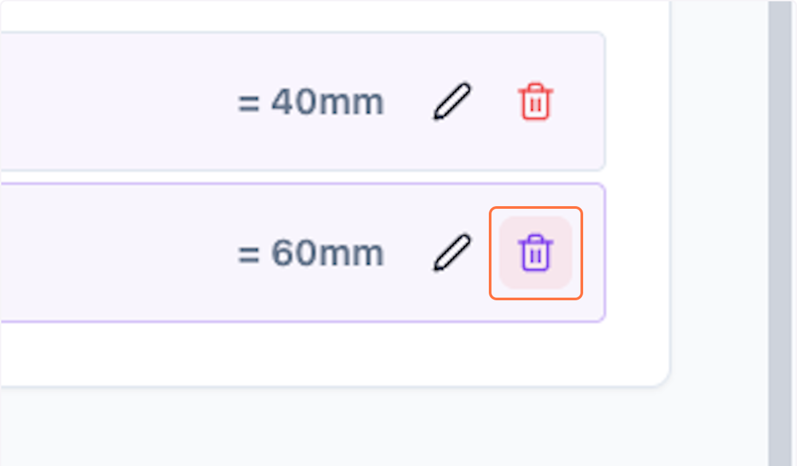

### 12. Click on Delete
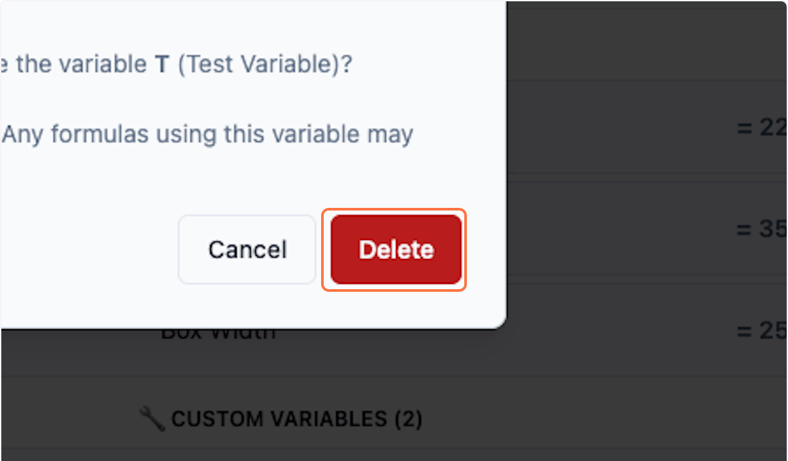

### 13. This is the final list of variable 

 