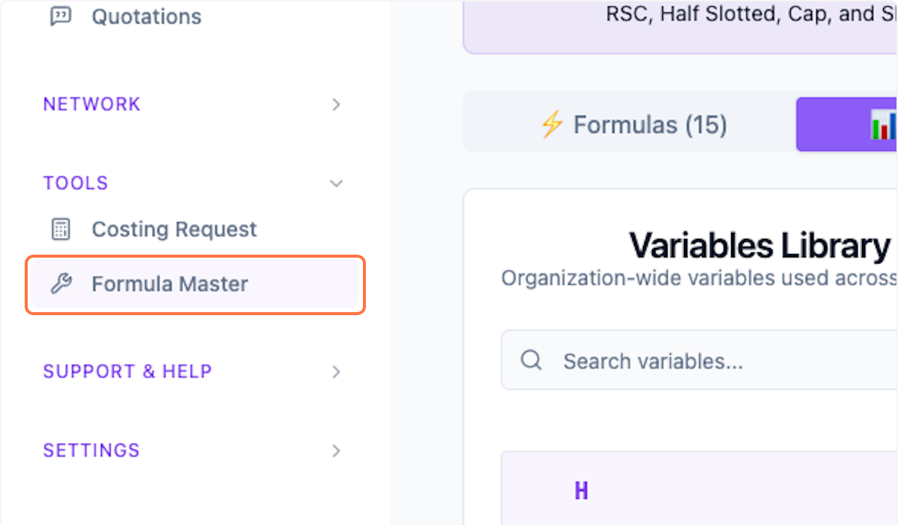
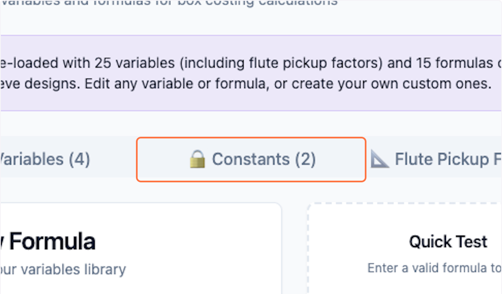
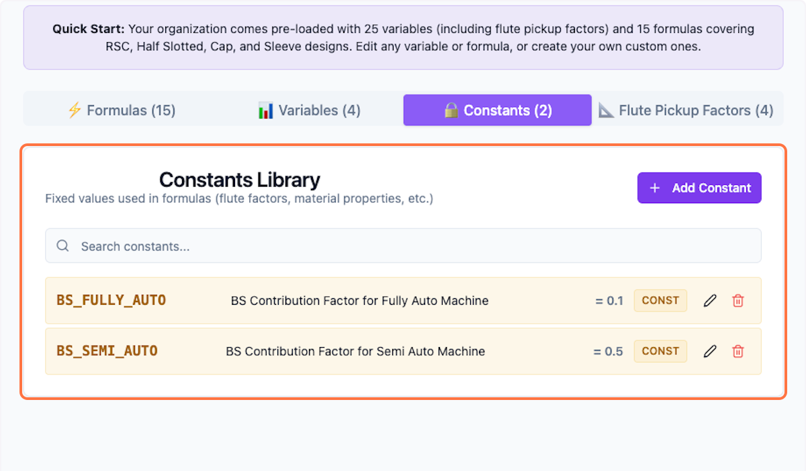
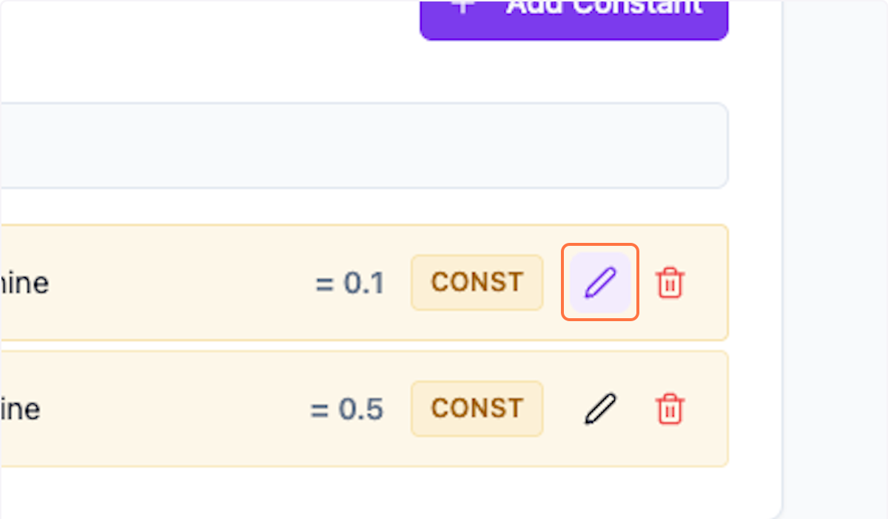
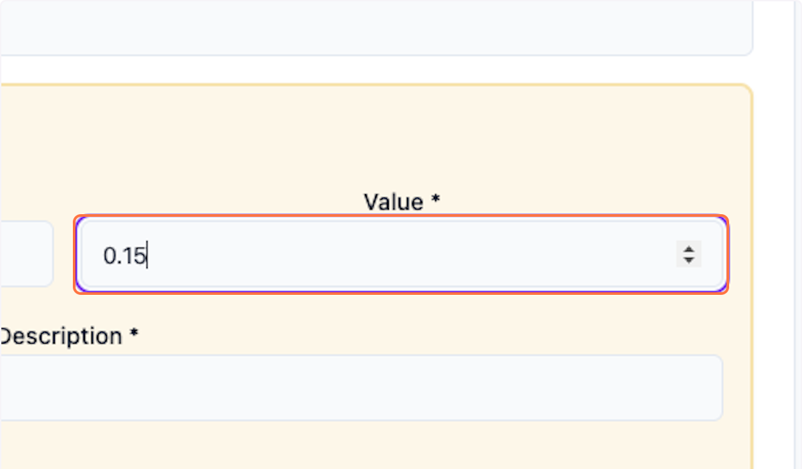
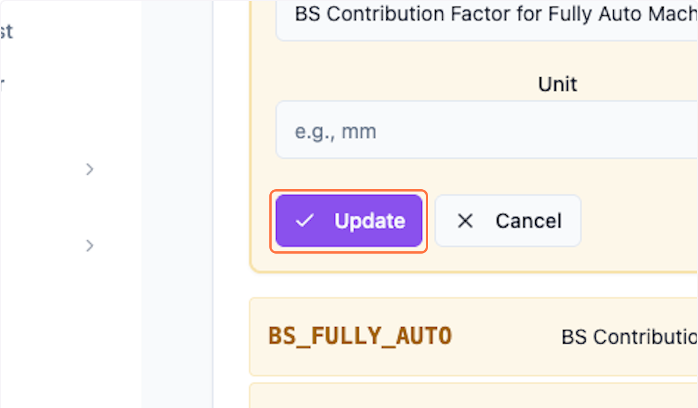

# Constants: Update in Packwares CMS

## # [Packwares CMS](https://cms.packwares.com/formula-master/variables)

### 1. Click on Formula Master

### 2. Click on 🔒 Constants (2)

### 3. View all the available constants

2 default constants manage bursting strength by machine type. Customize as needed, but don't delete them.

### 4. Click on pencil icon to edit

### 5. Make required changes

### 6. Click on Update to save

### 7. Preview your changes here.

 