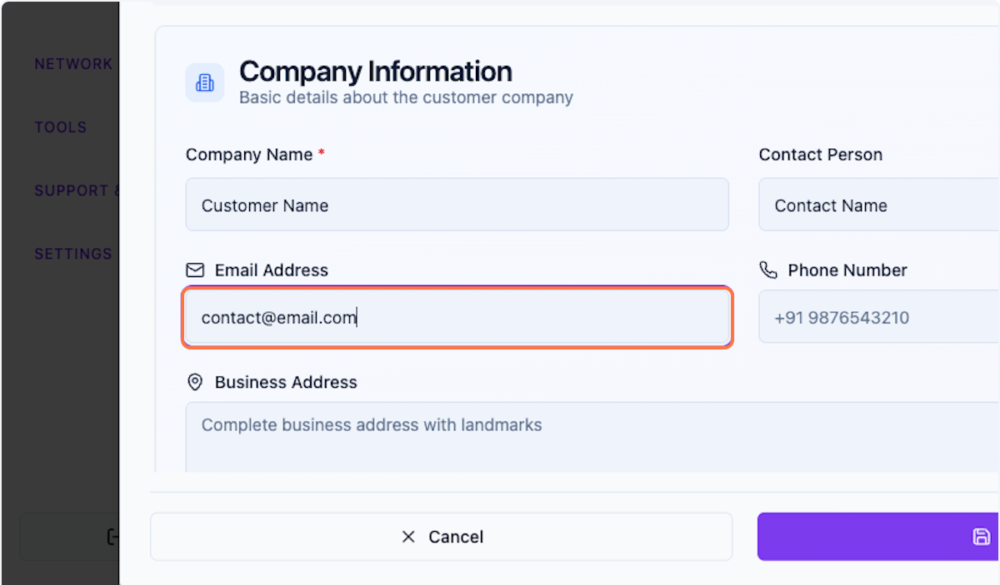
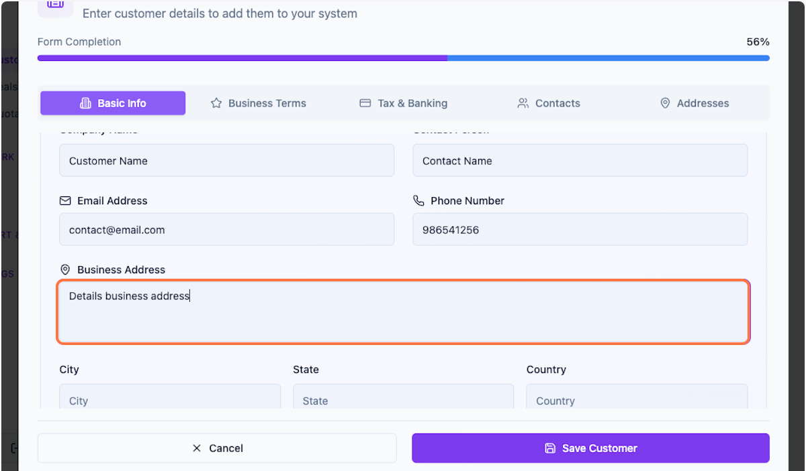
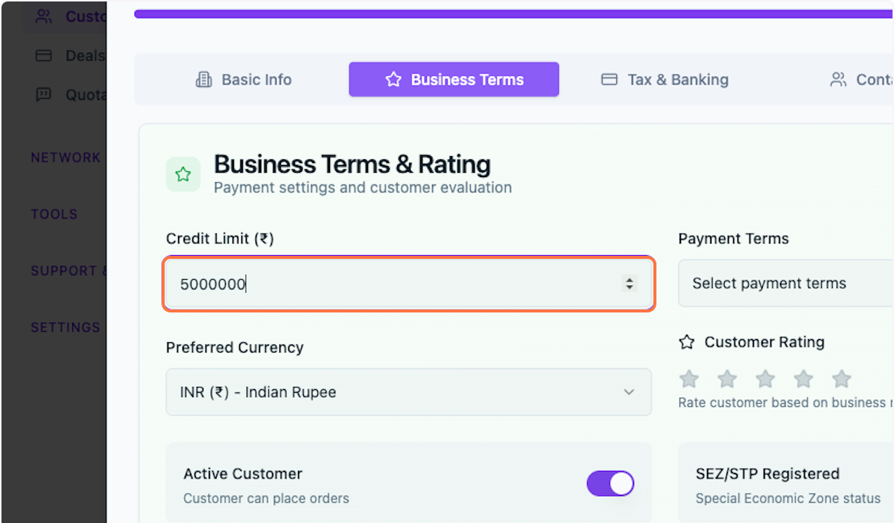
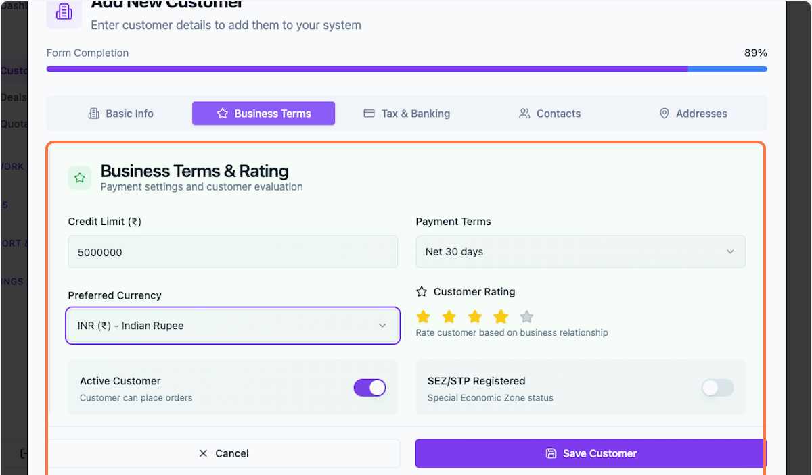
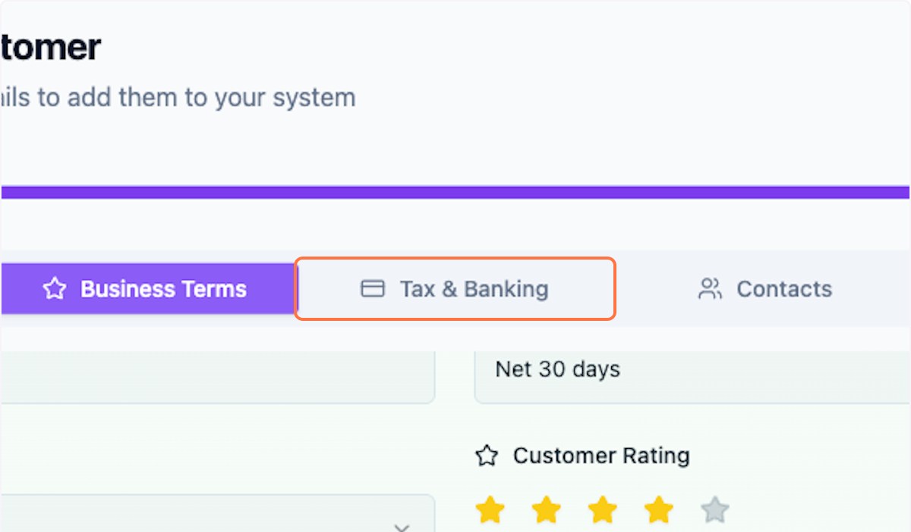

# Customer Management

Learn how to create and manage customer profiles in PackWares CMS. Customer profiles store essential information including contact details, business terms, credit limits, and banking information.

> **Quick Access:** [Open Customer Management →](https://cms.packwares.com/manufacturer/customers)

---

## Creating a New Customer

Follow these steps to add a new customer to your PackWares CMS system.

### Step 1: Open Add Customer Form

Click the **Add Customer** button to open the customer creation form.

### Step 2: Enter Customer Name

Enter the customer's company or business name. This is a required field.

### Step 3: Add Contact Name (Optional)

Enter the primary contact person's name. This field is optional but recommended for better communication.

### Step 4: Enter Email Address (Optional)

Provide the customer's email address for correspondence and notifications.

**Example:** `user@example.com`

### Step 5: Add Phone Number (Optional)

Enter the customer's phone number for direct communication.

**Example:** `986541256`

### Step 6: Enter Business Address

Provide the customer's complete business address. This is important for shipping and billing purposes.

---

## Configuring Business Terms

### Step 7: Open Business Terms Section

Click on the **Business Terms** tab to configure payment and credit terms. You can complete this section now or return to it later.

### Step 8: Set Credit Exposure Limit

Enter the maximum credit exposure limit for this customer. This represents the total outstanding amount the customer can have at any given time.

> **Tip:** Setting appropriate credit limits helps manage financial risk and ensures healthy cash flow.

### Step 9: Complete Additional Business Terms

Fill in any additional business terms and conditions. These can be customized based on your agreement with the customer.

> **Note:** This section can be updated at any time based on your business requirements and convenience.

---

## Tax & Banking Information

### Step 10: Add Tax & Banking Details

Click on the **Tax & Banking** tab to add tax identification and banking information for this customer.

---

## Saving Your Customer

### Step 11: Save Customer Profile

Once you've entered all required information, click **Save Customer** to create the customer profile.

---

## What's Next?

After creating a customer profile, you can:

- Create deals and quotations for this customer
- View customer transaction history
- Update customer information anytime
- Manage customer-specific pricing and terms

**Related Documentation:**
- [Creating Deals](/docs/deals.md)
- [Generating Quotations](/docs/quotation-generate.md)
- [Settings: User Roles](/docs/settings-user-roles.md)